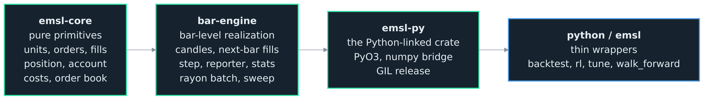
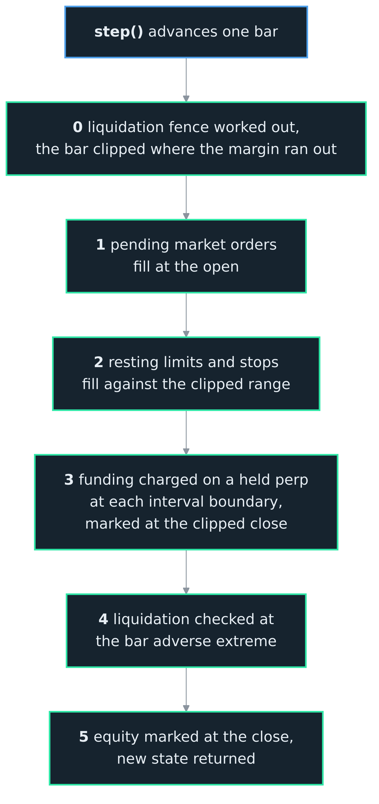

<h1>OCEΛNO <small><code>embeddable-market-simulation-library</code></small></h1>

  
  
  
  

  <a href="../README.md">Introduction</a> &nbsp;•&nbsp;
  <a href="Python_API.md">Python API</a> &nbsp;•&nbsp;
  <a href="RL_Guide.md">RL Guide</a> &nbsp;•&nbsp;
  <a href="Plotting.md">Plotting</a> &nbsp;•&nbsp;
  <b>Architecture</b> &nbsp;•&nbsp;
  <a href="Decisions.md">Decisions</a> &nbsp;•&nbsp;
  <a href="Contributor_Guide.md">Contributor Guide</a> &nbsp;•&nbsp;
  <a href="Validation_Guide.md">Validation Guide</a>

 
 
 
 

## Architecture

The library is a cargo workspace: a pure-Rust core exposed to Python through one extension module. The dependency order is bottom-up, and logic flows up, never sideways. A lower layer never reaches for a higher one, and the Python-specific concerns (numpy, the GIL) live only in the one crate that links Python.

 

### Crates

Three crates, each building only on the one beneath it:

1. **`emsl-core`** (pure Rust; no Python, no candle series, no parallelism). The fidelity-neutral primitives: unit newtypes, the OHLCV bar, the order and fill types, the netted position, and the account (spot and perp equity, funding, liquidation, realized and unrealized PnL), the cost model, and the fixed-slot resting order book. This is the reuse seam a future tick or L2 engine would share, so nothing here holds the candle series, the windows over it, or any bar-level fill logic.
2. **`bar-engine`** (pure Rust; no Python). The bar-level realization: the shared candle series with zero-copy windows, the next-bar fill model, the single `step()` state machine, the optional reporter and its stats, and the Rayon batched runner. It builds only on `emsl-core`.
3. **`emsl-py`** (the only Python-linked crate; PyO3, compiled to `emsl._emsl`). A thin shell over `bar-engine`: it parses arguments, copies candles once from numpy, hands state back as dicts, vends the zero-copy observation view, and releases the GIL around the batched step. It holds no simulation logic.

The Python package `emsl` re-exports the compiled `Engine` and `Batch`, and adds thin wrappers (`emsl.backtest`, `emsl.rl`) that hold no simulation logic of their own. `emsl.tune` searches a strategy's parameters by running many backtests across worker processes; it is orchestration over `Backtester` and holds no simulation logic (ADR 0021). `bar-engine` also carries an in-core sweep that drives compiled Rust strategies over a parameter grid; it is not exposed to Python, since it can only run strategies compiled into the engine, and it survives as the Criterion benchmark of the GIL-free path (ADR 0011).

 

  
  
<i>The dependency order is bottom-up and logic flows up, never sideways: the <code>emsl-core</code> primitives, then <code>bar-engine</code>, then the one Python-linked crate <code>emsl-py</code>, then the thin <code>python/emsl</code> wrappers.</i>

 

### The step lifecycle

`reset()` positions at the first bar; `reset_at(offset)` starts at an arbitrary bar, which is how the RL env gives each env a different slice of history. `step()` advances exactly one bar, resolves it, then marks and returns the state.

The defining rule is **no same-bar lookahead**: an order decided while looking at bar `t` is resolved against bar `t+1`, never the bar the decision saw. Within a step the events follow the bar:

1. Pending market orders fill at the open.
2. Resting limit and stop orders fill against the bar's range (a gap through a limit still fills at the limit, never better; a triggered stop fills at the worse of open and trigger).
3. Funding is charged on a held perp position at each interval boundary (ADR 0017).
4. Liquidation is checked at the bar's adverse extreme, the low for a long, the high for a short, and the forced close is then priced where the margin ran out rather than at that extreme, so a loss cannot exceed the margin behind it ([ADR 0052](Decisions.md)).
5. Equity is marked at the close, and the new state is returned.

 

  
  
<i>The five events resolved within one <code>step()</code>, in order: market fills, resting fills, funding, liquidation, then the close mark.</i>

 

Equity is the authoritative account value: `quote + base * price` on spot, `quote + unrealized` on a perp. The `realized_pnl` field is cumulative realized trading PnL and is never added on top of equity.

 

### Zero-copy and batching

The candle series lives once behind an `Arc<[Candle]>`, so thousands of envs share it with no duplication; each env is an independent cursor with its own account and orders. Two consequences follow:

- **Observations are views.** A single env's observation is a read-only numpy view straight onto the shared candle buffer, no copy. `Candle` is `repr(C)`, so a window of candles reinterprets directly as a `(window, 5)` float array; the view is read-only because the buffer is shared, and it keeps the engine alive so the data outlives it. The batched observation gathers each env's window into a fresh `(N, window, 5)` array, since the windows differ once envs start at different offsets. See [ADR 0008](Decisions.md).
- **The batched step is GIL-free.** `Batch.step_all` applies a batched action array and steps every env in parallel on the Rayon pool with the Python GIL released. Because the envs are independent and there is no cross-env reduction, batched stepping is bit-identical to stepping each env in a loop, an invariant asserted by a test.

 

### Reporting

By default the engine records nothing but the running state, so its memory does not grow with the length of the run. With `report=True` it keeps an equity curve, sampled each step, and a trade log, one row per closed portion of a position. Performance statistics (return, CAGR, Sharpe, Sortino, Calmar, drawdown, volatility, and the trade metrics) are derived from those two buffers. Reporting stays off for RL and is never part of the state the agent sees.

 

### Design decisions

Every non-obvious behavior is a recorded decision, settled with its reasoning before the code that depends on it. They are collected, one numbered entry each, in [Decisions](Decisions.md); the code and the other guides cite them by number.

 

### Why the seam

The bar engine is the approximate, bar-level member of a planned family. A future sibling is a high-precision tick and L2 engine; the members differ by fidelity tier, not by brand. `emsl-core` is where they meet: the position, the account, the costs, and the order book are the same regardless of how a fill is resolved, so a tick engine reuses them and only replaces the resolution layer that `bar-engine` provides. That is why L2 is refused at this tier rather than bolted on.
