<h1>OCEΛNO <small><code>embeddable-market-simulation-library</code></small></h1>


<div style="padding-top: 0px;">
  <a href="https://github.com/atOCEANO/embeddable-market-simulation-library/releases"></a>
  <a href="https://www.python.org/downloads/"></a>
  <a href="https://www.rust-lang.org/"></a>
  <a href="https://opensource.org/licenses/MIT"></a>
</div>

<sub>
  <a href="../README.md">Introduction</a> &nbsp;•&nbsp;
  <a href="Python_API.md">Python API</a> &nbsp;•&nbsp;
  <a href="RL_Guide.md">RL Guide</a> &nbsp;•&nbsp;
  <b>Plotting</b> &nbsp;•&nbsp;
  <a href="Architecture.md">Architecture</a> &nbsp;•&nbsp;
  <a href="Decisions.md">Decisions</a> &nbsp;•&nbsp;
  <a href="Contributor_Guide.md">Contributor Guide</a> &nbsp;•&nbsp;
  <a href="Validation_Guide.md">Validation Guide</a>
</sub>

<br>
<br>
<br>
<br>

## Plotting

`emsl.chart` turns a frame, your own arrays and a run into a picture. It computes nothing: you bring the numbers.

**`show()` draws it in the notebook cell.** Inline, where you are already working, zoomable and pannable in place. No second window, no server, no viewer to launch, and nothing to configure for your particular frontend.

**It stays there.** The chart is stored inside the `.ipynb`, so the notebook you open next year shows the same charts, still interactive, with no kernel running and nothing re-executed. A notebook you send somebody shows them what you saw.

**`save()` writes one HTML file** instead, which opens in a browser by double-clicking it, for the people who want the picture without the notebook.

Every example on this page ends in `.show()` and appears in the cell below the code. There are three things you can give it, and each one alone is already a chart.

**A frame** is candles, volume, a crosshair readout, zoom and pan:

```python
emsl.chart(frame=frame).show()
```

**An array** finds itself a home, over the candles or on a panel of its own:

```python
emsl.chart(frame=frame, marks=squeeze).show()
```

**A run** draws itself, with no configuration at all:

```python
emsl.chart(frame=frame, run=result).show()
```

That last one is entry and exit arrows on the exact bars they filled on, an equity curve, a drawdown panel and a trade log under the chart. Click a row and the chart frames that trade; click an arrow and the row reveals itself.

All three together is the chart most people are actually after:

```python
strategy = SmaCross(fast=20, slow=50)

result = emsl.backtest.Backtester(
    candles=frame,
    market="perp",
    fee_taker=0.0005,
).run(strategy)

emsl.chart(
    frame=frame,
    marks=[
        Line(values=strategy.fast, name="SMA 20"),
        Line(values=strategy.slow, name="SMA 50", style="dashed"),
    ],
    run=result,
    title="SMA 20/50",
).show()
```

Everything but the two `Line`s came out of the `BacktestResult`, and those two are the arrays the strategy itself decided on.

<div align="center">
  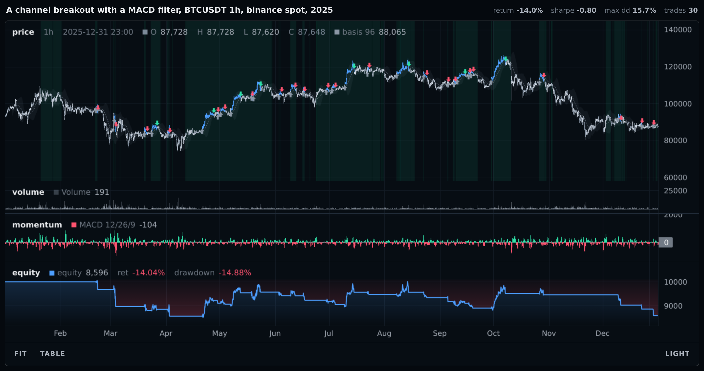
  <p style="margin: 0;"><i>One call, a year of hourly candles: nothing above it names a panel, an axis, a colour or a scale</i></p>
</div>

<br>

Every image on this page is generated from a document these notebooks actually produced, so none of them can drift from what the library draws today.

Every argument here is named, and this guide keeps it that way throughout. `chart` also accepts them positionally and matches by type, which is convenient once you know it and invisible until you do:

```python
emsl.chart(frame, [Line(strategy.fast, "SMA 20"), Line(strategy.slow, "SMA 50")], result).show()
```

Naming buys more than clarity. `run=` is checked, so an array passed to it by mistake is refused; positionally, the same mistake is silently drawn as a line.

<br>

### Small charts, whole

Every one of these is complete. Nothing is elided and nothing needs a strategy, and every picture below is the output of the snippet above it, on six months of hourly BTCUSDT.

**A moving average over the candles.**

```python
emsl.chart(frame=frame, marks=Line(values=frame.close.rolling(50).mean(), name="SMA 50")).show()
```

<div align="center">
  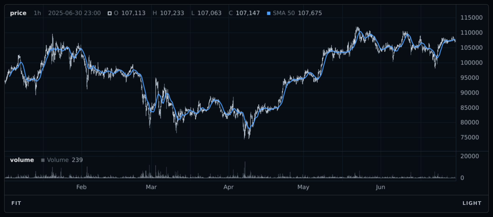
  <p style="margin: 0;"><i>One array and no panel asked for: it overlaid the candles because it sits in their range</i></p>
</div>

<br>

**An oscillator**, given a panel of its own, with the levels that make it readable.

```python
emsl.chart(frame=frame, marks=[
    Line(values=rsi, name="RSI 14", panel="rsi"),
    Level(value=70.0, panel="rsi", style="dotted"),
    Level(value=30.0, panel="rsi", style="dotted"),
]).show()
```

<div align="center">
  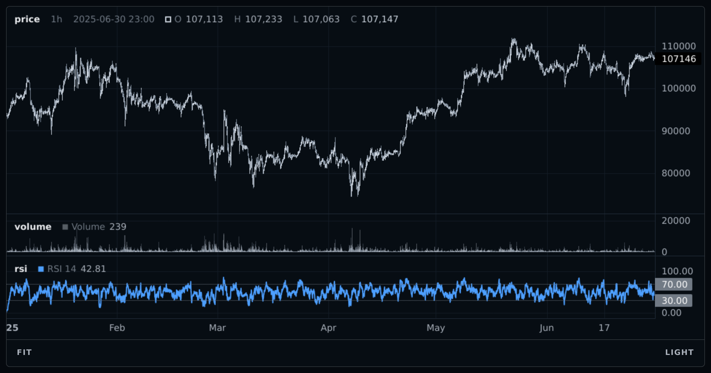
  <p style="margin: 0;"><i>The RSI took a panel of its own, because laying 0 to 100 over a price in the tens of thousands would have flattened the candles to a line</i></p>
</div>

<br>

**A channel**, shaded between its edges.

```python
emsl.chart(frame=frame, marks=Band(upper=upper, lower=lower, name="bollinger",
                                   fill="#8b97a51a")).show()
```

<div align="center">
  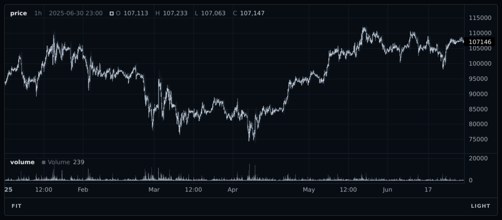
  <p style="margin: 0;"><i>One mark holding two edges; a single number as the lower edge makes the same mark a threshold instead</i></p>
</div>

<br>

**Shade the bars** a filter says are risk-off.

```python
emsl.chart(frame=frame, marks=Background(values=risk_off, fill="#ff547026")).show()
```

<div align="center">
  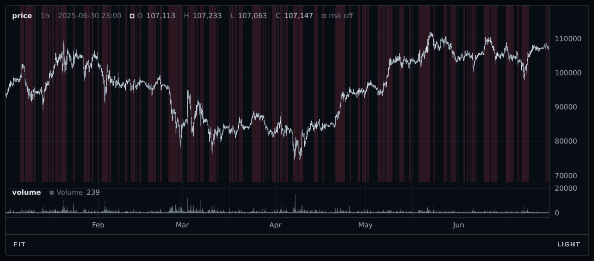
  <p style="margin: 0;"><i>A boolean array painted behind the bars, which keep their own colours on top of it</i></p>
</div>

<br>

**A glyph wherever a condition fires**, which is Pine's `plotshape`.

```python
emsl.chart(frame=frame, marks=Markers(mask=crossed, shape="arrow_up", offset=-16)).show()
```

<div align="center">
  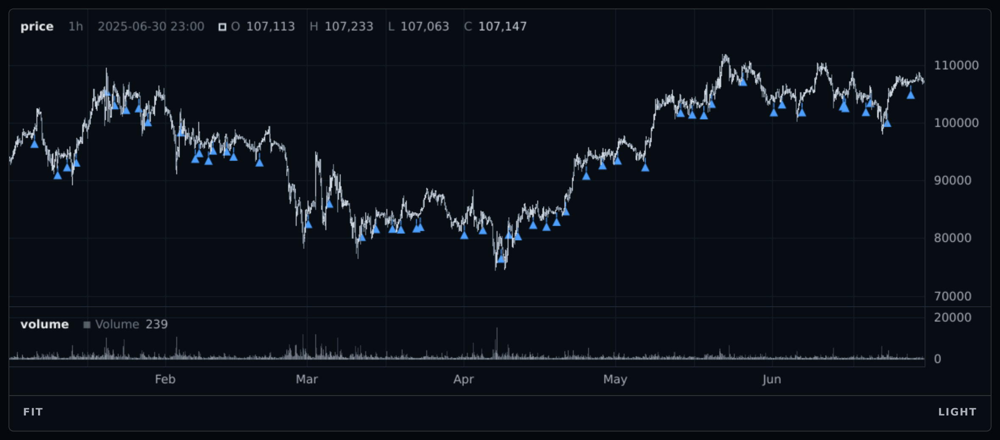
  <p style="margin: 0;"><i>One Markers rather than one Marker per bar, which is also one thing for the renderer to draw rather than sixty</i></p>
</div>

<br>

**Colour the candles themselves** by anything you like.

```python
emsl.chart(frame=frame, candle_color=numpy.where(trending, "#4d9fff", None)).show()
```

<div align="center">
  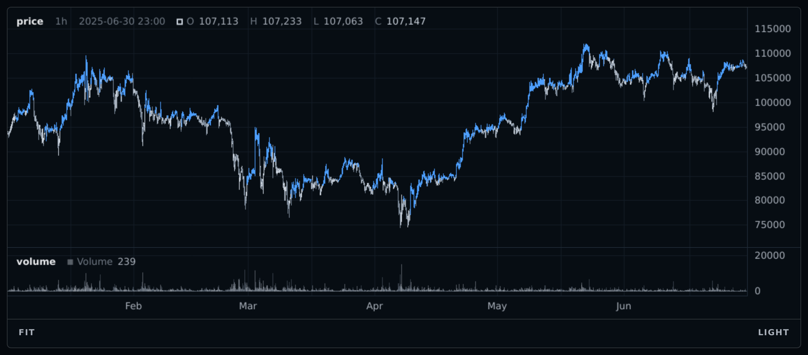
  <p style="margin: 0;"><i>The candle_color argument is Pine barcolor; None at a bar leaves that bar alone, so the untinted ones are not a colour choice</i></p>
</div>

<br>

**Two features, one panel each**, both pinned so they are comparable.

```python
emsl.chart(frame=frame, marks=[
    Line(values=fast_z, name="z 24", panel="z24"),
    Line(values=slow_z, name="z 168", panel="z168"),
], panels=[
    Panel(name="z24", range=(-5.0, 5.0)),
    Panel(name="z168", range=(-5.0, 5.0)),
]).show()
```

<div align="center">
  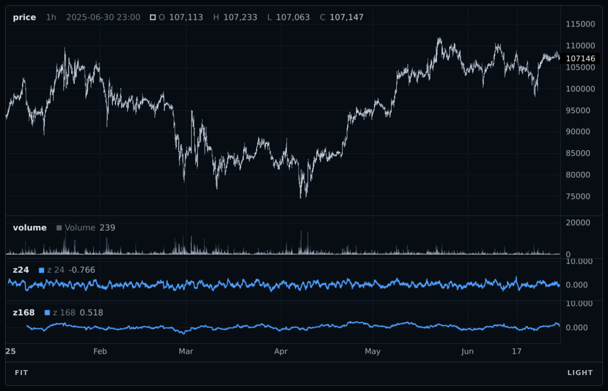
  <p style="margin: 0;"><i>Both panels pinned to the same range, which is the only reason the two readings can be compared by eye</i></p>
</div>

<br>

**A file to send to somebody with no Python.**

```python
emsl.chart(frame=frame, run=result, title="SMA 20/50, BTCUSDT 1h").save(path="run.html")
```

<br>

## Before there is a strategy

Most research hours go somewhere there is no backtest to draw: you have a frame, you have an idea, and you want to know whether the idea says anything. Nothing on this page needs a `BacktestResult`, and this is the part of the guide worth reading first if you have not written a strategy yet.

Start with the feature against the price it is supposed to explain.

```python
def vam(close, n):
    logret = numpy.log(close / close.shift(1))
    return numpy.log(close / close.shift(n)) / (logret.rolling(n).std() * numpy.sqrt(n))


emsl.chart(
    frame=frame,
    marks=[
        Line(values=vam(close=frame.close, n=72), name="vam 72", panel="vam"),
        Level(value=0.0, panel="vam", style="dotted"),
    ],
).show()
```

<div align="center">
  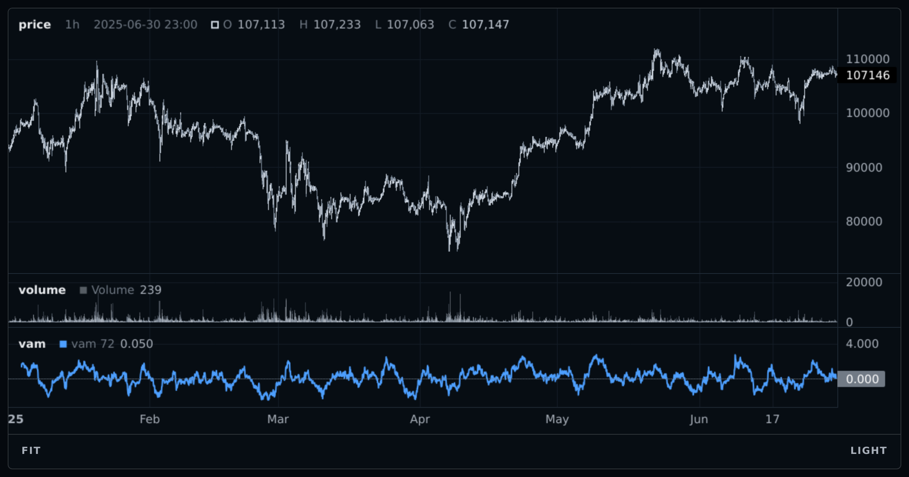
  <p style="margin: 0;"><i>The feature against the price it is supposed to explain, which is where every idea starts</i></p>
</div>

<br>

Then the same feature at several lookbacks, one panel each, **all pinned to the same window**. Autoscaled panels are not comparable, and three of them side by side will happily tell you three parameterisations behave identically when they do not.

```python
emsl.chart(
    frame=frame,
    marks=[
        Line(values=vam24, name="vam 24", panel="vam24"),
        Line(values=vam72, name="vam 72", panel="vam72"),
        Line(values=vam168, name="vam 168", panel="vam168"),
    ],
    panels=[
        Panel(name="vam24", range=(-5.0, 5.0)),
        Panel(name="vam72", range=(-5.0, 5.0)),
        Panel(name="vam168", range=(-5.0, 5.0)),
        Panel(name="volume", show=False),
    ],
    height=940,
).show()
```

Then the chart that answers the question, which is the feature's extremes against whatever you think they predict:

```python
emsl.chart(
    frame=frame,
    marks=[
        Background(values=regime, fill={"hi": "#2fe0a81f", "lo": "#ff54701f"}),
        Line(values=vam72, name="vam 72", panel="vam", color=shade),
        Band(upper=vam72, lower=2.0, only="above", panel="vam",
             fill=("#2fe0a800", "#2fe0a859")),
        Line(values=forward, name="fwd 4h", panel="fwd"),
        Level(value=0.0, panel="fwd", style="dotted"),
    ],
    candle_color=numpy.where(numpy.abs(vam72) > 2.0, "#4d9fff", None),
    title="vam 72 extremes against the next four hours",
).show()
```

<div align="center">
  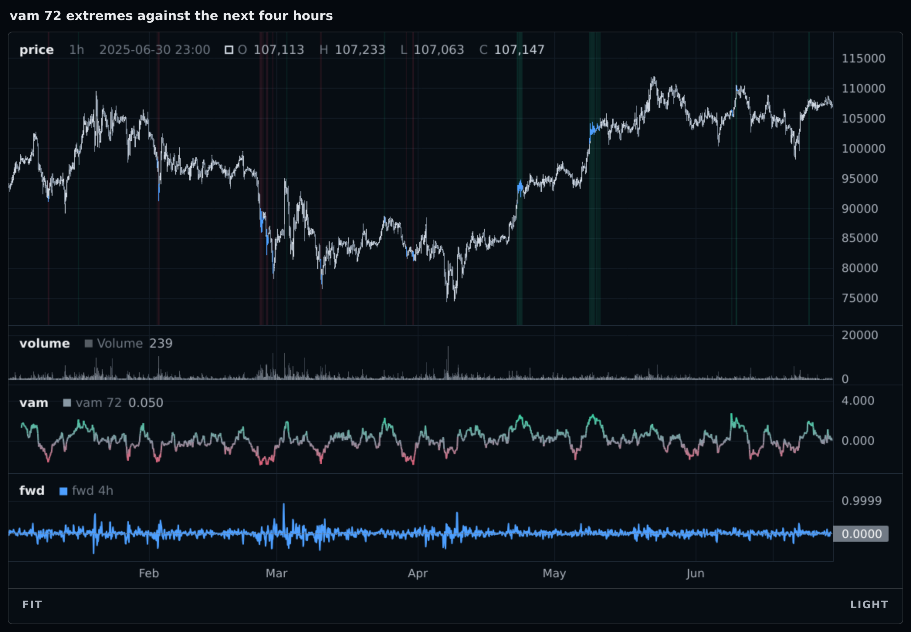
  <p style="margin: 0;"><i>The extremes shaded, the candles tinted, and the next four hours on its own panel underneath; the question and the answer on one picture</i></p>
</div>

<br>

**A forward return is where this goes wrong.** It is shorter than the frame, so it raises, and the message offers a front pad. Taking that offer is the mistake: `forward[k]` is the return that *starts* at bar `k`, so padding the head puts it at bar `k + 4` and draws the **trailing** return under a label saying forward. Nothing raises and nothing on screen says so. Pad the tail instead.

```python
# numpy.asarray first: on a pandas Series the division aligns on the INDEX
# rather than by position, so it returns a full-length series of NaN in the
# wrong places and the concatenate lands T + 4 values that the length check
# cannot tell from a mistake
close = numpy.asarray(frame.close, dtype=float)
forward = numpy.concatenate([close[4:] / close[:-4] - 1.0, numpy.full(4, numpy.nan)])
```

The rule is about when a value belongs, never about making a number fit.

**What this will not draw**, and should not: a feature against its forward return as a scatter, a histogram of trade returns, an autocorrelation. None of those has a time axis, and a chart whose x axis is bars is the wrong instrument for them. They belong wherever you already draw scatters.

<br>

## The one rule

The layer computes nothing and knows no indicator names ([ADR 0042](Decisions.md)). There is no `sma` here, no `rsi`, no registry and no way to ask for one. You bring arrays; it turns them into marks.

That is the one rule worth knowing before you write anything. Everything is computed once, in Python, before a pixel is drawn, which is also why a chart keeps working when the kernel is gone: there is no live process to ask ([ADR 0041](Decisions.md)).

<br>

## Your own arrays

```python
fast = frame.close.rolling(20).mean()
slow = frame.close.rolling(50).mean()

emsl.chart(
    frame=frame,
    marks=[
        Line(values=fast, name="SMA 20"),
        Line(values=slow, name="SMA 50", style="dashed"),
    ],
    run=result,
).show()
```

A pandas Series, a numpy array or a plain list all work, and all are read **by position**. A Series index is never consulted, so align it yourself: an index on a feature is a promise the library cannot check, and a `reindex` is exactly where lookahead gets introduced.

**Pass the strategy's own arrays, not a fresh copy.** A strategy's arrays are plain attributes, so `Line(values=strategy.fast)` draws the values the fills were decided on. Recompute a moving average outside the strategy and the picture is of a rule that was never executed, differing from the traded one by a warm-up convention or an off-by-one nobody will find. They are usually identical, which is the worst version of this bug.

```python
strategy = SmaCross(fast=20, slow=50)

result = emsl.backtest.Backtester(candles=frame).run(strategy)

emsl.chart(
    frame=frame,
    marks=[
        Line(values=strategy.fast, name="SMA 20"),
        Line(values=strategy.slow, name="SMA 50"),
    ],
    run=result,
).show()
```

<br>

### Naming the window once

The call above writes `20` twice: once as the parameter the strategy trades on, once as prose in the legend. Under [`tune`](Python_API.md#tuning) that legend is wrong on every trial but one, because each trial builds a fresh strategy with a different window and nothing rewrites the string.

A `marks()` method fixes it, and it is an ordinary method rather than anything the library knows about. Nothing calls it during a run, so a sweep pays nothing for it.

```python
class SmaCross(emsl.Strategy):
    def __init__(self, fast=20, slow=50):
        self.fast_n = fast
        self.slow_n = slow

    def init(self, engine):
        close = pandas.Series(engine.data[:, 3])
        self.fast = close.rolling(self.fast_n).mean().shift(1).to_numpy()
        self.slow = close.rolling(self.slow_n).mean().shift(1).to_numpy()

    def next(self, state, engine):
        ...

    def marks(self):
        return [
            Line(values=self.fast, name=f"SMA {self.fast_n}"),
            Line(values=self.slow, name=f"SMA {self.slow_n}", style="dashed"),
        ]
```

```python
emsl.chart(frame=frame, marks=strategy.marks(), run=result).show()
```

A list of marks is flattened like any other, so what the strategy declares and what you add at the call site compose. The strategy says what it traded on; the chart cell adds whatever you are comparing it against today, without editing the class or re-running anything.

```python
emsl.chart(
    frame=frame,
    marks=strategy.marks() + [Line(values=buy_and_hold, name="buy and hold")],
    run=result,
).show()
```

This is the whole of the organisational answer. There is no registration hook, no `Strategy.plot`, and nothing to switch off, for the reasons in [ADR 0044](Decisions.md).

<br>

### The length contract

Two lengths are accepted, and they mean different things ([ADR 0037](Decisions.md)).

| Length | Drawn from |
| :--- | :--- |
| `T` | bar 0. Entry `i` is bar `i`. |
| `T - 1` | bar 1. Entry `i` is bar `i + 1`. |

Anything else raises and names both numbers, because a silent trim or pad is a chart that is off by an amount nobody can see.

```
ValueError: series 1 has 4000 values, frame has 8760; expected 8760, one per bar,
or 8759, drawn from bar 1 like an equity curve or a diff
```

`T - 1` draws late because drawing a short array early is the visual signature of lookahead, and because the engine records an equity point only on a real advance, so `equity_curve[i]` is the account at tick `i + 1`. `numpy.diff` and `close.pct_change().dropna()` are the same shape.

**It is not because `i + 1` is the earliest bar such a value could be known.** That reading is wrong and it costs people an afternoon. A number you read off `state` inside `next` was known **on** bar `i`, and passing it short draws your whole exposure story one bar right of the candles it is supposed to explain. Two arrays accumulated in the same loop can want opposite treatments:

**The best fix is to say which you meant while you are writing the loop**, because that is where the meaning is obvious. `Recorder` collects values under a name and an alignment, and hands back one value per bar:

```python
class Carry(emsl.Strategy):
    def init(self, engine):
        self.log = Recorder(bars=engine)

    def next(self, state, engine):
        self.log.at_bar(state, lev=..., flat=state["position"] == 0.0)
        self.log.at_next(state, liq=...)


emsl.chart(
    frame=frame,
    marks=Line(values=strategy.log["lev"], name="leverage", panel="risk"),
    run=result,
).show()
```

A bar you returned early from is a gap, and a boolean one is `False`, so a warm-up needs no padding at all. One key holds one kind and one alignment; changing either raises rather than converting. It costs one array write per value per bar, so leave it out of a strategy you mean to sweep across hundreds of trials.

`emsl.plot.at_bar` and `at_next` are the same two rules as plain functions, for when you already have a list. Both pad a boolean with `False` rather than NaN, which matters: `numpy.array([numpy.nan]).astype(bool)` is `True`, so a mask padded the way a float is padded reports the event it was looking for on its last bar. A risk report built by hand that way printed one liquidation on a run that never had one.

A `Background` mask is guarded for you too: a NaN or a `pandas.NA` shades nothing rather than shading everything. A mask you cast yourself, before it reaches the chart, is your own.

<br>

### A NaN is a gap

A value that does not exist stops the line ([ADR 0038](Decisions.md)). It is never dropped, because dropping it makes the two neighbours adjacent: a trailing stop that existed on bars 0 to 40 and again on bars 900 to 940 would appear as a smooth line through 860 bars where there was no stop at all. Pine users know this as `plot.style_linebr` rather than `plot()`, which joins across `na`.

Not dropping the row is necessary and it is not sufficient, which took a browser to find out ([ADR 0073](Decisions.md)). The document carries a null for every missing bar, exactly as it should, and lightweight-charts joins straight across that too, on both the line and the area series. So the hole is cut rather than merely marked: a gapped series is drawn as one renderer series per contiguous run. The cost is one of those per hole, so a mask that alternates every few bars is a real payload rather than a cosmetic one, and a rolling warm-up still costs nothing, because a leading run of non-finite values is carried as an offset rather than as data.

Infinities are gaps too.

<br>

## Colour

**`color`** is the mark itself: a line's stroke, a histogram's columns, a band's edges, a marker's glyph. **`fill`** is an area: under a line, between a band's edges, behind the bars for a background.

`color` takes one value **or one per bar**, so a line can carry a second variable in its own colour. A per-bar colour obeys the same length contract as any other array, and `None` at a bar leaves it alone. The two marks that draw one shape rather than one per bar, `Level` and `Marker`, take a single colour and refuse an array, naming the substitute: a flat `Line` carrying the colour you wanted.

`fill` takes **one colour or a gradient**, never one per bar. For a fill whose colour changes with a condition, draw two conditional bands, one per state:

```python
Band(upper=senkou_a, lower=senkou_b, only="above", fill=GREEN + "33"),   # A over B
Band(upper=senkou_b, lower=senkou_a, only="above", fill=RED + "33"),     # B over A
```

The edges swap places in the second, and that is the whole trick. It is not guessable, which is why it is written down here. `Background` is the exception that does vary per bar, through a `{label: colour}` map.

```python
Line(
    values=fast,
    name="SMA 20",
    color=numpy.where(fast >= slow, "#2fe0a8", "#ff5470"),
)
```

`ramp` turns numbers into colours, so the line becomes a gradient in which every shade is a real value:

```python
Line(
    values=fast,
    name="SMA 20",
    color=ramp(
        values=fast.diff() / fast,
        colors=["#ff5470", "#8b97a5", "#2fe0a8"],
    ),
)
```

The domain is the data's own finite range unless you pin it with `domain=`, so a ramp is comparable inside one chart but not across two slices. Non-finite values are ignored when the domain is computed and return `None`, which every colour argument reads as "leave this bar alone". Pin the domain when two charts have to speak the same language.

`candle_color=` on `chart` is Pine's `barcolor()`. It is a chart argument rather than a mark, because the candles came out of the frame rather than out of a list you built.

```python
held = numpy.zeros(len(frame), dtype=bool)

for trade in result.trades:
    held[trade["entry_tick"]:trade["exit_tick"] + 1] = True

emsl.chart(
    frame=frame,
    marks=strategy.marks(),
    run=result,
    candle_color=numpy.where(held, "#4d9fff", None),
).show()
```

<div align="center">
  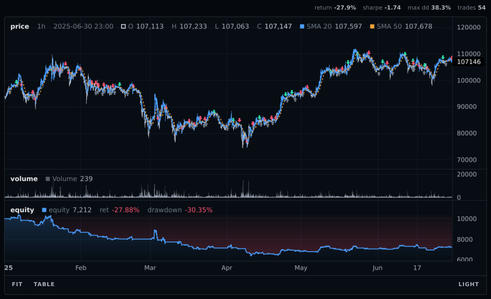
  <p style="margin: 0;"><i>The bars the strategy was actually holding, which the equity curve alone never tells you</i></p>
</div>

<br>

<br>

## Panels

`"price"` always exists, comes first and carries the candles. `"volume"` appears when the frame has a usable volume column, `"equity"` and `"drawdown"` when a result is passed, and any other name is created the first time a `panel=` mentions it.

**A bare array overlays the candles unless doing so would cost them more than half the price panel** ([ADR 0039](Decisions.md)). Otherwise it gets its own panel. That is a guess about the picture, never about your intent: it may put a series somewhere you would not have, but it can never quietly flatten the candles to get it there. Override it with `panel=`, including `panel="price"`.

`panels=` **configures** panels; it never creates or removes one. A name it does not recognise configures nothing, so a typo costs you nothing rather than manufacturing a blank pane. Listing panels also fixes their order relative to each other, without moving them relative to the panels you did not list.

```python
emsl.chart(
    frame=frame,
    marks=marks,
    run=result,
    panels=[
        Panel(name="momentum", weight=1.6, range=(0.0, 100.0)),
        Panel(name="equity", weight=2.0, scale="log"),
    ],
).show()
```

`show=False` removes a panel and everything on it, and a hidden panel ships no data at all rather than merely going unpainted. `weight` is a stretch factor rather than pixels, so a layout holds at any size: the numbers only matter against each other, and you only need one when you want a panel bigger or smaller than it comes out by default. `scale` is `"linear"`, `"log"` or `"percent"`, matching the **A / L / %** buttons every panel draws in its own axis, so a reader can change any of it without re-running anything. Log on the equity panel turns compounding into a straight line, which is the honest way to look at a long run.

<br>

### Turning off what a run brings

A `BacktestResult` brings four things: the arrows, the trade log, an equity panel and a drawdown panel. All four are optional.

```python
emsl.chart(
    frame=frame,
    run=result,
    trades=False,                                   # no arrows, no table
    panels=[
        Panel(name="drawdown", show=False),           # gone, and not in the file
        Panel(name="equity", scale="percent"),      # the same curve, as a return
    ],
).show()
```

One thing to know before reading a percent axis, because it is the one scale whose meaning depends on where you are looking. Percent is per series, not per panel: the renderer baselines each one at its own first **visible** point. So two series that start on different bars are measured from different anchors while the viewport sits left of the later one, and both the baseline and the numbers move as you pan. On a panel carrying one series that is exactly what you want. On a panel carrying a curve and a benchmark that begins two hundred bars in, the two percentages are not comparable until you scroll past the later start. The `%` button puts any panel into that mode, so it is reachable without ever passing `scale="percent"`.

**The drawdown panel is not the equity panel as a percentage**, which is the usual reason people reach to turn it off. Percent rescales the axis and leaves the curve identical, so it tells you nothing new. Drawdown measures the fall from the running peak, so it pins to zero on every new high and only moves when you are below one. On a run that ends up 23%, the two answer different questions at the same bar:

| | at the worst bar |
| :--- | :--- |
| equity, as a return | **+3.72%** |
| drawdown | **-8.55%** |

Up on the year and eight percent below the high, on the same bar. The equity curve cannot show you the second number, which is the whole reason the panel exists.

<br>

## The marks

```python
from emsl.plot import (
    Panel, Line, Histogram, Band, Level, Marker, Markers, Background, ramp,
)
```

| Mark | What it draws |
| :--- | :--- |
| `Line(values, name, ...)` | a line through your values. `step=True` holds each value until the next, which is right for a position or a discrete action. |
| `Histogram(values, name, ...)` | columns from `base` to your values. |
| `Band(upper, lower, name, ...)` | a shaded region between two edges. `lower` may be a single number, so a channel and a threshold are one mark. |
| `Level(value, name, ...)` | a horizontal line across the panel. |
| `Marker(bar, ...)` | one annotation at one bar. |
| `Markers(mask, ...)` | a glyph on every bar a condition holds, which is what `plotshape` does. |
| `Background(values, ...)` | shading behind the bars, on a condition of your choosing. |
| `ramp(values, *stops, domain=)` | numbers to colours, one per value. |
| `Recorder(engine)` | collect values inside `Strategy.next` with their alignment declared. |
| `at_bar(values)`, `at_next(values)` | the same two rules as plain functions, for a list you already have. |

`Band` with `only="above"` or `"below"` is the conditional fill an overbought shading actually is: it exists solely where the upper edge is past the reference, and its gradient runs from that edge toward each excursion's own extreme, so a brief poke past the level shades faintly and a deep one shades hard.

```python
emsl.chart(
    frame=frame,
    marks=[
        Line(values=rsi, name="RSI 14", panel="momentum"),
        Level(value=70.0, panel="momentum", style="dotted"),
        Band(upper=rsi, lower=70.0, only="above", panel="momentum",
             fill=("#ff547000", "#ff547059")),
        Band(upper=rsi, lower=30.0, only="below", panel="momentum",
             fill=("#2fe0a800", "#2fe0a859")),
    ],
    run=result,
).show()
```

<div align="center">
  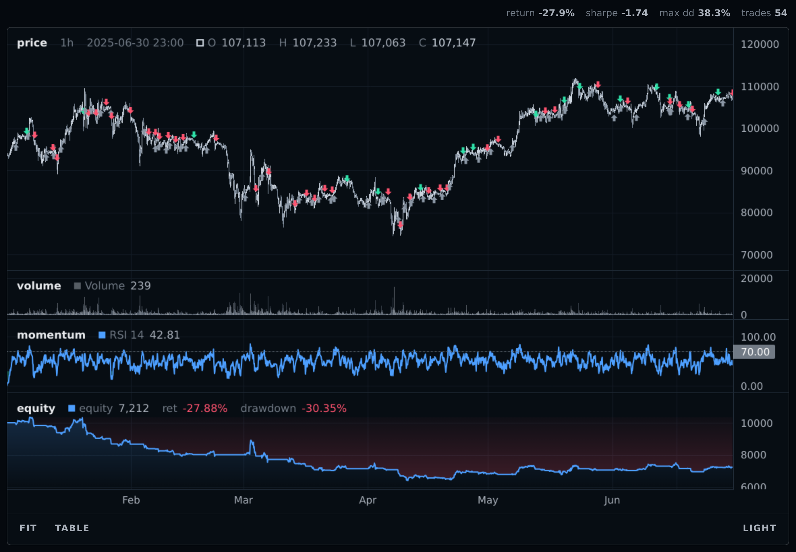
  <p style="margin: 0;"><i>The gradient runs from the level toward each excursion own extreme, so a brief poke past 70 shades faintly and a deep one shades hard</i></p>
</div>

<br>

`Background` takes a boolean mask for one region, or an array of labels for as many as you like, with a `{label: colour}` map in which an absent label shades nothing. That absence is what keeps a three-state background readable.

```python
Background(
    values=regime,
    fill={"elevated": "#4d9fff29", "extreme": "#ff547033"},
)
```

`Marker`'s **`offset` is a signed distance in pixels**, positive upward, so the glyph holds its distance from the bar at every zoom level instead of drifting as the scale changes. That is the one thing the engine's own trade arrows cannot express, which is why they are drawn by a different mechanism. Its `shape` is one of `"circle"`, `"square"`, `"arrow_up"` or `"arrow_down"`, and anything else raises. To anchor on the panel's own scale rather than in pixels, pass `value=`, which is a price only on a price panel; leave it out and the marker sits at the bar's own extreme.

`Markers` is the same glyph on every bar a boolean says so, which is `plotshape`:

```python
# emsl.ta.crossover, not a hand-rolled comparison: it pads with False rather
# than NaN, because bool(nan) is True and a float warm-up fires the rule on
# precisely the bars where nothing is known (ADR 0063). Hand-rolling it also
# aligns two pandas slices on their index rather than by position, which is a
# different array of a different length
crossed = emsl.ta.crossover(fast, slow)

emsl.chart(frame=frame, marks=[Markers(mask=crossed, shape="arrow_up", offset=-16)]).show()
```

It takes the same keywords as `Marker`, and `value=` additionally accepts an array, so each glyph can sit on its own bar's reading of something rather than on the bar's extreme. One `Markers` is one thing the renderer draws, where a list comprehension over `flatnonzero` is one for every glyph.

**The mask must be boolean.** A comparison that has passed through a warm-up arrives as floats carrying NaN, and `astype(bool)` reads NaN as `True`, which puts a glyph on the one bar the condition could not be evaluated on. That raises rather than drawing it.

<br>

## What raises

Four inputs depend on the frame, so only `chart` can check them, and all four refuse rather than draw something plausible.

| | |
| :--- | :--- |
| a result from a different number of bars | trade rows carry bar indices into the original series, so every marker would land on the wrong bar. |
| a series of an unaccepted length | named above. |
| a logarithmic panel whose data reaches zero | the offending bar is named. |
| a frame with no timestamps, duplicate timestamps, or a non-finite price | a chart cannot fabricate its x axis, the renderer keys on time, and a candle missing one of its four numbers cannot be drawn. |

Beyond those, a keyword given a value outside its own published vocabulary is an ordinary `ValueError` where you wrote it, the same as `Level(nan)`. Everything else degrades in the open and says so.

A missing volume column draws no volume panel. A volume column that is all zero, all NaN or constant draws no panel **and warns**, because that is what a dead feed looks like and it renders as a perfectly plausible flat chart. A `Level` with no `panel=` goes on the price panel, and if its value is nowhere near the candles it **warns**, because the renderer draws a level as a price line and a price line is not something the axis autoscales to: `Level(70)` beside a coin at 61,000 is off screen, which is the most common oscillator idiom in the world failing in silence. A second `BacktestResult` warns and the first is used.

<br>

## `focus`

A trade dict, a `(start, end)` pair of bar indices, or an integer `N` meaning the last `N` bars. It moves the viewport and never slices the data, so every marker stays on its own bar, and its bounds are clamped to the frame rather than refused.

```python
worst = min(result.trades, key=lambda trade: trade["net_pnl"])

emsl.chart(frame=frame, marks=strategy.marks(), run=result, focus=worst).show()
```

<div align="center">
  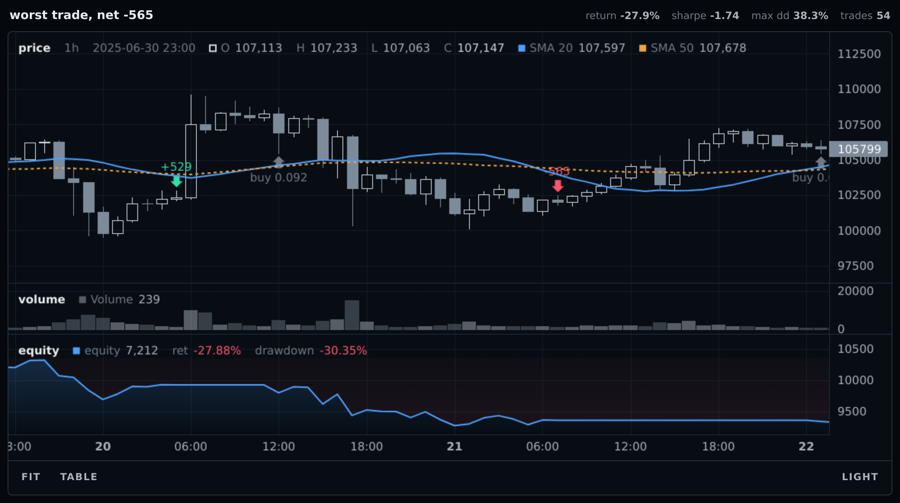
  <p style="margin: 0;"><i>The focus argument moves the viewport and never slices the data, so every marker stays on the bar it belongs to</i></p>
</div>

<br>

<br>

## Output

```python
chart = emsl.chart(frame=frame, run=result, title="SMA cross 20/50, BTCUSDT 1h")

chart.show()                            # inline in a notebook cell
chart.save(path="reports/run.html")     # one self-contained file
chart.spec()                            # the underlying document, for tests
```

`show` embeds an iframe whose content is stored in the `.ipynb`, so the chart survives the notebook being saved, closed and reopened with **no kernel and no network**. Outside a notebook `show` raises and points at `save`, because there is nothing to draw into and a silent no-op is the expensive kind of nothing.

<br>

### Where it renders

**In the cell**, and it stays in the notebook file. A chart's whole document, data and renderer together, is the cell's output, and a notebook stores its outputs. So the `.ipynb` you commit, email or reopen in six months carries every chart you drew, still zoomable, with the kernel shut down. Nothing is fetched when it opens, because there is nothing left to fetch.

There is nothing to configure and no renderer to select. Libraries that need to be told their environment need it because their JavaScript has to be loaded into the frontend, and every frontend loads scripts differently. A chart here is an iframe carrying its whole document inline: the cell output holds one `<iframe>`, no script tag, no module loader and no URL, so the host only has to render an iframe. That is the same job in every frontend.

Two places it will not draw, both because the host removes the iframe before it ever runs:

- **An untrusted notebook.** JupyterLab and Notebook 7 sanitise HTML output in a notebook you did not execute yourself, which strips the iframe. Click Trust Notebook once. This applies to every JavaScript charting library, not only this one.
- **GitHub's notebook viewer.** It strips iframes and scripts, so a notebook browsed on github.com shows the prose and the printed output but blank where the charts are. Export with `nbconvert --to html`, or `save` the charts as files and link them.

`title=` and `stats=` are drawn above the plot, the title on the left and the numbers on the right, which is what turns a saved file into a document rather than a picture. A file arrives in someone's inbox with only its filename, and a chart that cannot say which strategy over which period is an untitled squiggle.

```python
emsl.chart(
    frame=frame,
    run=result,
    title="Carry 24/168 at 3x, BTCUSDT perp, 2025",
    stats=["total_return_pct", "sharpe", "max_drawdown_pct", "exposure_pct"],
).save(path="reports/carry-2025.html")
```

Passing a run gives you four by default: return, sharpe, max drawdown and trade count. `stats=[]` shows none. The formatting is decided in Python, so the renderer only draws the pairs it is handed.

<br>

### Comparing runs

One run is rich and the others are curves, and that asymmetry is on purpose: two sets of trade arrows on one chart is unreadable. So pass the run you are studying, and the rest as equity lines.

```python
# neighbours is a dict of {label: BacktestResult}: a run carries what produced
# it (ADR 0051) but not what you decided to call it, so the name comes from your
# own bookkeeping rather than off the result
stack = numpy.stack([run.equity_curve for run in neighbours.values()])

emsl.chart(
    frame=frame,
    marks=[
        Band(
            upper=stack.max(axis=0),
            lower=stack.min(axis=0),
            name="neighbours",
            panel="equity",
            fill="#8b97a51f",
        ),
    ] + [
        Line(
            values=run.equity_curve,
            name=label,
            panel="equity",
            color="#8b97a5",
            width=1,
        )
        for label, run in neighbours.items()
    ],
    run=win,
    panels=[Panel(name="equity", weight=3.0, scale="log")],
).show()
```

**Do not also pass a `Line` for the winner's own equity.** Passing `win` as the run already draws it, and adding one puts the same series in the legend twice and reports it twice on the crosshair. Passing a second `BacktestResult` warns and uses the first.

<br>

### Size

`height` is the height of a **notebook cell**, in pixels, and `show(height=)` overrides it for one display without rebuilding anything. A **saved file sizes itself to the window** instead, which is what makes one file right on a laptop and on a wide monitor, and what lets another page embed it in an iframe of the page's own choosing.

```python
chart = emsl.chart(frame=frame, run=result, height=420)

chart.show()                      # a 420px cell
chart.show(height=900)            # the same document, drawn taller
chart.save(path="run.html")       # fills whatever window opens it
```

There is no width, anywhere. A chart fills whatever contains it. A notebook cell is a container of unknown size, so a pinned width is how a chart ends up cut off on one screen and short of the edge on another, and it is the one place the layout would stop holding at any size. Panels are sized with `weight`, a stretch factor, for the same reason.

<br>

### What it costs

Every chart embeds its own copy of the renderer, about 260 KB once escaped, plus its data. Twenty charts in one notebook is therefore roughly 4 MB of identical JavaScript, paid once into the `.ipynb` and again into every copy of it.

That is not an oversight and it is not worth engineering around. Sharing one copy would mean the iframes reaching into the parent document, which is exactly the coupling that makes a saved file stop working when it leaves the notebook it came from. The advice is fewer, richer charts: a chart with five panels on it costs one renderer, and five charts cost five.

Set the look once and forget it:

```python
emsl.chart_defaults(theme="dark", height=560)
```

The theme is baked in at render time and both palettes travel, so a saved file keeps its look and still toggles light and dark offline. `palette` overrides individual colours in either mode.

Nothing is painted over the plot. There is no watermark and no way to add one: a chart is somebody's evidence about their own strategy, and a mark across it serves the library rather than the reader.

<br>

## Drawing past the last candle

Some series are computed from real bars but belong ahead of them: an Ichimoku cloud sits 26 bars in the future, and so does a projected pivot or a regression carried forward. `future=` gives the axis room for them.

```python
lead = numpy.full(26, numpy.nan)
senkou_a = numpy.concatenate([lead, ((tenkan + kijun) / 2).to_numpy()])   # T + 26

emsl.chart(
    frame=frame,
    marks=Band(upper=senkou_a, lower=senkou_b, name="cloud", fill=GREEN + "33"),
    future=26,
).show()
```

The axis grows and the candles do not, so nothing that never traded appears; only a series can reach out there. With `future=` set, a third length is accepted, `T + future`, drawn from bar 0.

<div align="center">
  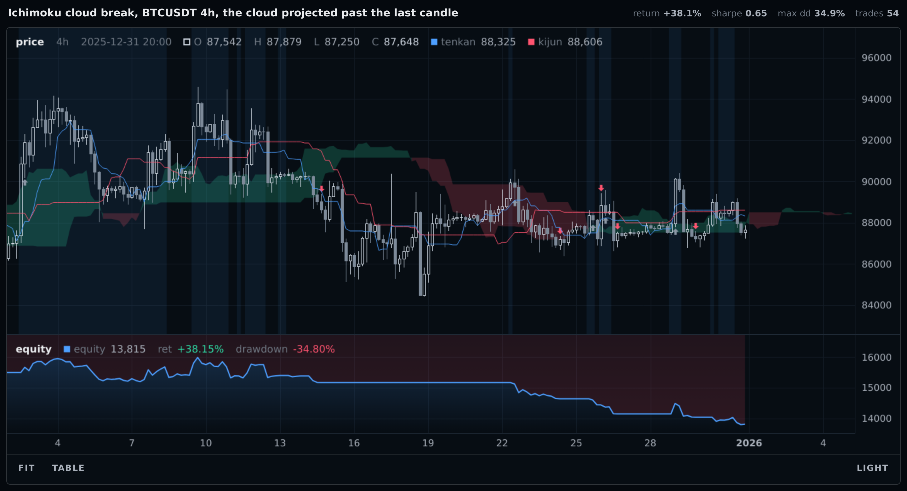
  <p style="margin: 0;"><i>The cloud runs on past the last candle, over axis that carries no bar; nothing out there is a candle, because only a series can reach into that room</i></p>
</div>

<br>

There is deliberately **no `offset=` on a mark.** In Pine, `plot(offset=26)` makes one identifier mean the displaced value inside `plot()` and the undisplaced value inside an expression, so `close > leadLine1` is a rule that does not match the picture you are looking at, and nothing tells you. Here one array has one meaning and the axis is what changes. Shifting is your own `shift(26)`, and the offset shows up in the series' own start bar where you can read it.

A negative displacement needs nothing at all: Chikou is `close.shift(-26)`, which is `T` long and draws where it should.

<br>

## What cannot be charted

- **No intrabar path.** A bar is four numbers; the fill happened somewhere inside it and there is nothing honest to draw between them.
- **No individual fills.** The trade log holds closed round trips, so an entry built from three adds is one arrow at the weighted average price.
- **No order book, queue position or latency.** The engine models none.
- **No RL training rollout.** `VectorEnv` runs with reporting off, so no trade log exists. Chart the evaluation rollout, which is an ordinary `Engine` loop.
- **No non-time axis.** Every chart here is over bars. A feature against forward return, or an average path after an event, is a scatter and belongs in whatever you already use for one.
- **No protection from your own lookahead.** Everything is computed once from fixed arrays, so a chart cannot repaint. But `rolling(20, center=True)` knows the future and will be drawn happily. What is guaranteed is narrower: the *fills* obey the engine's no-lookahead rule even when your signal does not.
- **No substituted price frame.** Passing a transformed frame, Heikin-Ashi candles for instance, alongside a result run on the real one passes every check, because the length is unchanged. The fills then land at prices that never traded: an exit arrow at 94,180 on a candle whose range is 93,050 to 93,900. Chart the frame the run was produced on, and put the transform on its own panel.

<br>

## Where it sits

One module, `python/emsl/_chart.py`, the marks in `python/emsl/plot.py`, and a vendored renderer under `python/emsl/_static/`. No new dependency: everything it needs is the standard library plus numpy, pandas is duck-typed and never imported unless you pass a DataFrame, and IPython is imported only inside `show`. `BacktestResult` gained one field, `initial`, the balance the run opened with, because the drawdown panel and the reported `max_drawdown_pct` have to be the same number ([ADR 0042](Decisions.md)); nothing else that already existed was touched.
