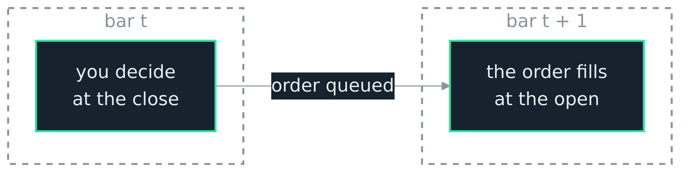

<h1>OCEΛNO <small><code>embeddable-market-simulation-library</code></small></h1>


<div style="padding-top: 0px;">
  <a href="https://github.com/atOCEANO/embeddable-market-simulation-library/releases"></a>
  <a href="https://www.python.org/downloads/"></a>
  <a href="https://www.rust-lang.org/"></a>
  <a href="https://opensource.org/licenses/MIT"></a>
</div>

<sub>
  <a href="../README.md">Introduction</a> &nbsp;•&nbsp;
  <b>Python API</b> &nbsp;•&nbsp;
  <a href="RL_Guide.md">RL Guide</a> &nbsp;•&nbsp;
  <a href="Plotting.md">Plotting</a> &nbsp;•&nbsp;
  <a href="Architecture.md">Architecture</a> &nbsp;•&nbsp;
  <a href="Decisions.md">Decisions</a> &nbsp;•&nbsp;
  <a href="Contributor_Guide.md">Contributor Guide</a> &nbsp;•&nbsp;
  <a href="Validation_Guide.md">Validation Guide</a>
</sub>

<br>
<br>
<br>
<br>

## Python API

Everything the package exports, and where each piece is documented in full:

| Import | What it is |
| :--- | :--- |
| `emsl.Engine` | The single environment: place orders, `step` one bar, read the state. [Below](#engine). |
| `emsl.Batch` | Many independent envs over one shared series, stepped in parallel with the GIL released. [Below](#batch). |
| `emsl.backtest` | `Backtester` and `Strategy`: drive a strategy over a series, get stats, equity, and trades. [Below](#backtesting). |
| `emsl.tune` | Search a strategy's parameters, each trial a full backtest, across worker processes. [Below](#tuning). |
| `emsl.rl` | `VectorEnv`, the Gymnasium vector env. [Below](#reinforcement-learning), in full in the [RL Guide](RL_Guide.md). |
| `emsl.sb3` | `EmslVecEnv`, the Stable-Baselines3 adapter. [RL Guide](RL_Guide.md#training). |
| `emsl.chart` | Draw a frame, your own arrays and a run as one self-contained HTML document. [Below](#plotting), in full in the [Plotting](Plotting.md) guide. |
| `emsl.chart_defaults` | Set the theme, height and palette every later chart uses. [Plotting](Plotting.md#output). |
| `emsl.plot` | `Line`, `Histogram`, `Band`, `Level`, `Marker`, `Background`, `Panel`, and `ramp`: the marks a chart carries. [Plotting](Plotting.md#the-marks). |
| `emsl.to_ohlcv` | Turn a DataFrame, a parquet path, or an array into the `(T, 5)` the engine takes. [Below](#data-input). |

All of it sits on the one Rust engine, so a backtest, an RL rollout, and a parameter search see the same fill model and the same costs.

<br>

## Quickstart

Build an engine over a candle array, step to the end, read the account. Everything else on this page is detail layered on top of this loop.

```python
import numpy as np
from emsl import Engine

close = 100 + np.random.randn(1_000).cumsum()
ohlcv = np.stack([close, close + 0.5, close - 0.5, close, np.full(1_000, 1000.0)], axis=1)

eng = Engine(ohlcv, market="spot", quote=10_000.0)
state = eng.reset()
while not eng.done():
    if state["position"] == 0 and state["tick_index"] % 100 == 0:
        eng.market_buy(0.1)                    # decided now, fills on the next bar's open
    state = eng.step()

print(state["equity"], state["position"])      # account value and position at the end
```

<br>

## Data input

`emsl.to_ohlcv(data)` returns the `(T, 5)` float64 array the engine takes, from any of three inputs:

| Input | Handling |
| :--- | :--- |
| numpy array | Must be `(T, 5)` OHLCV; returned contiguous and float64. |
| pandas DataFrame | Needs `open`, `high`, `low`, `close`, `volume` columns; any extra column is ignored. |
| parquet path | Read with pandas, then treated as the DataFrame case. |

A frame carrying a real (datetime) index must be sorted ascending and unique; a plain `RangeIndex` holds no timestamps, so it is exempt. A missing column, a wrong shape, or an unsorted index raises `ValueError`, and an unsupported type raises `TypeError`. pandas and pyarrow are imported only when a frame or a path is passed, so the numpy path needs neither installed.

The wrappers call it for you, so a DataFrame can go straight into `Backtester` or `VectorEnv`. Handing the `Backtester` a datetime index is also what stamps each trade with `entry_time` and `exit_time` ([Trades](#trades)).

<br>

## Engine

The single environment: build it, `reset`, place orders, `step`, read the state.

```python
from emsl import Engine

eng = Engine(
    candles,                 # (T, 5) numpy float64: open, high, low, close, volume
    market="spot",           # "spot" or "perp"
    quote=10_000.0,          # starting quote balance
    fee_taker=0.0006,        # taker fee, fraction of notional
    fee_maker=0.0002,        # maker fee, fraction of notional
    slippage_bps=0.0,        # slippage on market fills, basis points
    max_fill_fraction=1.0,   # cap on the fraction of a bar's volume one order takes
    max_open_orders=8,       # resting-order slots
    report=False,            # True keeps an equity curve and trade log
    leverage=10.0,           # perp margin cap on notional; 10x default, 0.0 = none
    impact=0.0,              # market-impact slippage coefficient; 0.0 means none
    funding_rate=0.0,        # perp funding per event on notional; long pays, short receives
    funding_interval=0,      # bars between funding events; 0 disables funding
)
```

`eng.shape` is `(T, 5)`, the number of candles the engine loaded; ask for 1000 and see `(873, 5)` and you know the source returned fewer, with no guessing.

### Stepping

| Call | Returns | Does |
| :--- | :--- | :--- |
| `reset()` | state | Reset the account and cursor to the first bar. |
| `step()` | state | Advance one bar, resolve the orders placed since the last step, mark, return the new state. |
| `done()` | bool | True when there is no next bar to step into. |
| `run(strategy)` | final state | Drive a strategy over the whole series (see [below](#running-a-strategy)). |

### Orders

| Call | Returns | Does |
| :--- | :--- | :--- |
| `market_buy(size)` / `market_sell(size)` | id or `None` | Taker order; fills at the next bar's open, pays the taker fee, takes slippage. `None` when the queue already holds `max_open_orders` for this bar. |
| `limit_buy(size, price)` / `limit_sell(size, price)` | id or `None` | Maker order; rests until a later bar reaches the price. `None` if the book is full. |
| `stop(side, size, trigger, reduce_only=False)` | id or `None` | Becomes a market order once a bar crosses `trigger`. `side` is `"buy"` or `"sell"`. Pass `reduce_only=True` for a stop-loss. |
| `order(side, size, type, price, trigger, reduce_only, post_only, tif)` | id or `None` | The primitive the shortcuts wrap; the only call that sets `post_only` and `tif`. |
| `close()` | id or `None` | Queue a reduce-only market order sized to the whole position. `None` when flat. |
| `cancel(order_id)` | bool | Drop a resting order. True if it was found. |
| `cancel_all()` | int | Drop every resting order; returns how many were dropped. |
| `replace(order_id, size=, price=, trigger=)` | id or `None` | Move a resting order: cancel it and rest a replacement with the same side, type and flags. `None`, and nothing placed, if it is no longer resting. |
| `is_bust()` | bool | True when the account died: a perp liquidation, or equity reaching zero ([ADR 0019](Decisions.md)). The engine does not stop on it. |
| `num_fills()` | int | Fills applied since the reset. Zero beside orders you placed means none of them filled. |
| `qty_from_weight(fraction)` | float | Base size for `fraction` of current equity, at the current close. |
| `qty_from_quote(cash)` | float | Base size for a `cash` amount in quote, at the current close. |

`order(...)` is the full primitive: `type` is `"market"`, `"limit"`, or `"stop"`, `tif` is `"GTC"`, `"IOC"`, or `"FOK"`, and it carries the three flags the shortcuts leave at their defaults. `reduce_only` marks a take-profit or stop-loss that can only shrink the position; `post_only` rejects a limit that would cross rather than turning it taker; `tif` decides what happens to the part of an order the next bar does not fill: `GTC` rests, `IOC` takes one bar then cancels the remainder, `FOK` fills the whole size against the bar or nothing. A market order is `IOC` unless you ask for `FOK`, since it never rests and so cannot tell `GTC` from `IOC`; a stop rests until it triggers ([ADR 0016](Decisions.md)). `FOK` is all or nothing against every clamp, not only the bar's liquidity, so a `FOK` the spot cash balance or the margin cap could only fill in part books nothing ([ADR 0025](Decisions.md)). A limit needs a `price` and a stop a `trigger`, else it is a `ValueError`, and a non-finite price or trigger is a `ValueError` too ([ADR 0027](Decisions.md)).

Three things about resting orders that are easy to get wrong. Nothing links them into an OCO group, so **re-placing a trailing stop with `stop()` each bar rests a new order every time**; the one that fills leaves its siblings live, and on a perp those open a position on the other side. Use `replace`, which cannot leave two alive and quietly does nothing once the order has filled ([ADR 0032](Decisions.md)). Pass `reduce_only=True` as well, so even a leaked stop can only shrink the position ([ADR 0028](Decisions.md)). And `close()` queues an ordinary market order, so it is `IOC`: on a thin bar the volume cap can fill only part of it and the remainder is cancelled rather than carried, which leaves a residual position. Check `state["position"]` rather than assuming.

```python
#  a trailing stop that stays one order and can only ever shrink the position
if state["position"] > 0.0:
    wanted = state["bar_close"] * 0.94
    if self.stop_id is None:
        self.stop_id = engine.stop("sell", state["position"], wanted, reduce_only=True)
    elif wanted > self.trigger:
        #  None here means the stop already filled, so nothing is armed again
        self.stop_id = engine.replace(self.stop_id, trigger=wanted)
    self.trigger = wanted
```

You decide on a bar and the order fills on the next one; there is no same-bar lookahead.

<br>

<div align="center">
  
  <p style="margin: 0;"><i>An order decided at the close of bar t is resolved against bar t+1, never the bar the decision saw.</i></p>
</div>

<br>

A market order crosses the spread and fills at the next open; a limit rests at your price and fills only when a candle reaches it, and a price that gaps through your limit still fills at the limit, never better. A limit that is already through the market when the bar opens is marketable, so it pays the taker fee even though it fills at your price; one that the bar has to come to pays the maker fee. A `post_only` limit that would cross is rejected rather than turned into a taker. Fills are volume-capped by `max_fill_fraction`, so one order cannot take more than that slice of a bar. Resting orders and the market orders waiting for the next bar each use `max_open_orders` slots, and beyond either cap a new order is rejected; the market queue empties every bar. The cap is per order, so several orders resolving against one bar each get their own slice ([ADR 0005](Decisions.md)), which is why the queue is bounded at all.

The position is netted: net long, net short, or flat, never both. Adding on the same side averages the entries; reducing or closing books the realized PnL on the part closed; flipping through zero closes the old side and reopens the rest at the new fill. On spot the position cannot go below zero: a sell is clamped to the current long, since shorting base needs a borrow this tier does not model, so a short and a flip through zero are perp behaviors ([ADR 0015](Decisions.md)).

### The state

Every `reset` and `step` returns a plain dict:

| Field | Type | Meaning |
| :--- | :--- | :--- |
| `tick_index` | int | Current bar index. |
| `base` | float | Base-asset balance (spot; zero on a perp). |
| `quote` | float | Quote-asset balance. |
| `position` | float | Signed size in base units, negative is short. |
| `avg_entry` | float | Volume-weighted entry price, zero when flat. |
| `equity` | float | Account value, marked in quote. |
| `mark_price` | float | Close on spot, mark on a perp. |
| `bar_open`, `bar_high`, `bar_low`, `bar_close` | float | The current candle. |
| `bar_volume` | float | The current candle's volume. |
| `realized_pnl` | float | Cumulative booked PnL. |
| `unrealized_pnl` | float | Open-position PnL at the mark. |
| `open_orders` | list | Resting limit and stop orders, each a dict. |

Each order in `open_orders` carries `id`, `side`, `kind` (`market`, `limit`, `stop`), `price`, `trigger`, `size`, `filled`, `remaining`, `status` (always `resting` here, since these are the resting orders), `reduce_only`, and `post_only`.

### Observations

`observation(lookback)` returns a read-only numpy `(rows, 5)` view of the `lookback` bars ending at the current bar, straight onto the shared candle buffer with no copy. It is `rows = lookback`, or fewer early in the series. The array is read-only, and because the candle buffer is never mutated a view held across a `step()` stays a snapshot of that tick's window rather than going stale; it stays valid for the whole life of the engine (numpy keeps the engine alive as the array's base), so you never need to copy it ([ADR 0008](Decisions.md)).

`eng.data` is the same kind of read-only, zero-copy view over the whole `(T, 5)` series rather than a window, so `eng.data[:, 3]` reads every close (columns are OHLCV by position). It is the full-series companion to `observation`, cursor-independent.

### Running a strategy

`run(strategy)` resets, calls `strategy.init(engine)` if it exists, then for each bar calls `strategy.next(state, engine)` and steps, returning the final state. The strategy places orders through the engine, so it can use any order type. It should not call `step` itself; the driver does.

```python
class BuyAndHold:
    def next(self, state, engine):
        if state["position"] == 0:
            engine.market_buy(1.0)

eng = Engine(candles, report=True)
final = eng.run(BuyAndHold())
```

### Results

With `report=True`, three accessors read the recorded run (each returns `None` when reporting is off):

- `stats(periods_per_year=365.0, risk_free=0.0)` returns the [stats dict](#statistics).
- `equity_curve()` returns a numpy array, one equity value per step.
- `trades()` returns a list of [trade dicts](#trades).

`periods_per_year` annualizes to your bar interval: 525600 for 1m, 8760 for 1h, 365 for 1d.

<br>

## Batch

Many independent envs over one shared candle series, stepped in parallel with the GIL released. Every env sees the same candles (shared by `Arc`, no duplication) but carries its own account and orders.

```python
import numpy as np
from emsl import Batch

b = Batch(candles, num_envs=512, market="spot", quote=10_000.0)  # same engine knobs
b.reset_all()                                # list of per-env state dicts
actions = np.array([...], dtype=np.float64)  # length num_envs, signed size
states = b.step_all(actions)                 # positive buys, negative sells, zero holds
```

| Call | Returns | Does |
| :--- | :--- | :--- |
| `reset_all()` | list of states | Reset every env, in parallel. |
| `step_all(actions=None)` | list of states | Apply the per-env signed-size actions (market orders) and step every env in parallel with the GIL released. |
| `done()` | bool | True when the envs have reached the last bar (they step in lockstep here). |
| `num_envs` | int | Number of envs (also `len(batch)`). |

Because the envs are independent, batched stepping is bit-identical to stepping each in a loop. The `Batch` also carries a lower-level RL surface (random-start reset, masked autoreset, batched feature observation, and per-env equity/done/bust arrays) used by [`emsl.rl.VectorEnv`](RL_Guide.md); most users drive RL through that env rather than these directly.

Each cost knob also takes an optional per-env override: pass `fee_taker_per_env`, `fee_maker_per_env`, `slippage_bps_per_env`, or `impact_per_env` as a length-`num_envs` float64 array and each env carries its own cost while sharing the one candle buffer. This is the primitive [`VectorEnv`](RL_Guide.md) uses for cost domain randomization ([ADR 0014](Decisions.md)); an override whose length is not `num_envs` is a `ValueError`.

<br>

## Reinforcement learning

`emsl.rl.VectorEnv` is a Gymnasium-compatible vectorized env over the `Batch`: `num_envs` independent envs share one copy of the series, each starting at a random offset, all stepped in parallel with the GIL released. You supply what the agent sees (`features`), how it is rewarded (`reward_fn`), and what its actions mean (`action_fn`, `action_space`).

```python
from emsl.rl import VectorEnv

env = VectorEnv(candles, features=indicators, num_envs=4096, window=60, market="perp")
obs, info = env.reset(seed=0)                  # (4096, 60, F) float32
obs, rewards, terminations, truncations, infos = env.step(actions)
```

Stable-Baselines3 will not take a Gymnasium vector env directly, so `emsl.sb3.EmslVecEnv` presents it as an SB3 `VecEnv`, which keeps the batch intact under PPO, A2C, DQN, and SAC:

```python
from stable_baselines3 import PPO
from emsl.sb3 import EmslVecEnv

PPO("MlpPolicy", EmslVecEnv(env)).learn(total_timesteps=100_000)
```

The full contract, every constructor argument, the observation and reward shapes, the action decoder, cost randomization, and the autoreset rules, is in the [RL Guide](RL_Guide.md).

<br>

## Backtesting

`emsl.backtest` wraps the single engine into a classic strategy runner. Reporting is always on, so the result carries the stats, equity curve, and trades.

```python
from emsl.backtest import Backtester, Strategy

class SmaCross(Strategy):
    def init(self, engine):
        self.close = engine.data[:, 3]        # optional; runs once after reset

    def next(self, state, engine):
        i = state["tick_index"]
        if i < 30:
            return
        fast = self.close[i - 10:i].mean()
        slow = self.close[i - 30:i].mean()
        if state["position"] == 0 and fast > slow:
            engine.market_buy(1.0)
        elif state["position"] > 0 and fast < slow:
            engine.close()

result = Backtester(candles, market="spot", fee_taker=0.0006).run(SmaCross())
print(result.stats["sharpe"], result.stats["max_drawdown_pct"])
print(result.equity_curve[-1], len(result.trades))
```

`Backtester(candles, market, quote, fee_taker, fee_maker, slippage_bps, max_fill_fraction, max_open_orders, leverage, impact, funding_rate, funding_interval, periods_per_year, risk_free)` shares the engine knobs and adds the two stats parameters. `run(strategy)` returns a `BacktestResult` with `.stats` (dict), `.equity_curve` (numpy array), `.trades` (list of dicts), and `.initial` (the balance the run opened with, which the curve does not contain because it records a point per advance). Subclass `Strategy` and override `next(state, engine)`; `init(engine)` is optional. The same `Strategy` is the unit [tuning](#tuning) searches: declare the tunable parameters as constructor arguments, and `tune` builds a fresh strategy per trial.

A strategy uses any order type, the sizing helpers, and the state's `open_orders` to manage risk. This one sizes each entry to half of equity and rests a reduce-only stop-loss under the position:

```python
class SmaWithStop(Strategy):
    def __init__(self, fast=10, slow=30, stop_pct=0.05):
        self.fast, self.slow, self.stop_pct = fast, slow, stop_pct

    def init(self, engine):
        self.close = engine.data[:, 3]                 # zero-copy view of every close

    def next(self, state, engine):
        i = state["tick_index"]
        if i < self.slow:
            return
        fast = self.close[i - self.fast:i].mean()
        slow = self.close[i - self.slow:i].mean()
        pos = state["position"]
        if pos == 0 and fast > slow:
            engine.market_buy(engine.qty_from_weight(0.5))          # enter with half of equity
        elif pos > 0:
            if fast < slow:
                engine.close()                                      # exit on the crossover
            elif not state["open_orders"]:                          # rest the stop once, while held
                trigger = state["bar_close"] * (1.0 - self.stop_pct)
                engine.stop("sell", pos, trigger, reduce_only=True)
```

The stop rests only once a position is held (orders fill on the next bar, so there is nothing to protect until then), and `reduce_only` keeps it from flipping the position short instead of closing it. This same class is ready for [tuning](#tuning): its `fast`, `slow`, and `stop_pct` are already constructor arguments.

### Statistics

`stats` is a dict with these keys:

| Key | Unit | |
| :--- | :--- | :--- |
| `total_return_pct`, `net_profit_pct`, `cagr_pct` | percent | Total return (net of fees; both names give the same figure) and annualized return. |
| `sharpe`, `sortino`, `calmar` | ratio | Risk-adjusted return; annualized. |
| `max_drawdown_pct`, `volatility_pct`, `exposure_pct` | percent | Largest peak-to-trough decline; annualized volatility; fraction of steps holding a position. |
| `win_rate` | fraction | Fraction of closed trades whose PnL net of the recorded fee is positive. |
| `profit_factor` | ratio | Net profit over net loss, both after fees (`inf` with no losses). |
| `num_trades` | count | Closed round trips. A position still open at the end is in the return and the exposure but in none of these four. |
| `avg_trade_pct` | percent | Mean net trade PnL as a percent of **starting** equity, not of the equity the trade opened with. |
| `num_fills` | count | Fills applied over the run. Zero beside orders you placed means the feed never filled them. |

The four trade metrics count completed round trips only, so `exposure_pct > 0` beside `num_trades == 0` means "still holding", not "never traded"; buy and hold reports a real return with zero trades ([ADR 0009](Decisions.md)). They read each trade's `net_pnl`, its whole round trip after fees, because on gross PnL a strategy whose edge is smaller than its costs reports a perfect win rate and an infinite profit factor beside a negative return ([ADRs 0029, 0030](Decisions.md)). So they reproduce from the log:

```python
win_rate = sum(t["net_pnl"] > 0 for t in result.trades) / len(result.trades)
```

`num_fills` is the canary for a dead feed: a series with no volume fills nothing, silently and correctly, and without it that run is indistinguishable from a strategy that never triggered ([ADR 0031](Decisions.md)). `periods_per_year` must be finite and positive.

The conventions (risk-free rate, sample deviation, annualization) are fixed in [ADR 0007](Decisions.md).

### Trades

Each entry in `trades()` is one closed portion of a position:

| Field | Meaning |
| :--- | :--- |
| `entry_tick`, `exit_tick` | Bars the position opened and this portion closed. |
| `side` | Side of the position that closed (`buy` for a long, `sell` for a short). |
| `size` | Base size closed. |
| `entry_price`, `exit_price` | Average entry before the fill, and the fill price. |
| `fees` | The whole round-trip fee on the closed size: its share of the position's entry fee plus the closing fill's fee ([ADR 0030](Decisions.md)). |
| `pnl` | Gross realized price PnL, before fees. |
| `net_pnl` | `pnl - fees`: what the trade actually added to the account. The trade statistics are built from this, so they reproduce from the log ([ADR 0030](Decisions.md)). |
| `bars_held` | Bars held, from the position's first entry. |

When the `Backtester` is given a pandas DataFrame or parquet input with a datetime index, each trade also carries `entry_time` and `exit_time`, the index values at those ticks. A raw numpy input has no index, so its trades stay tick-only.

<br>

## Tuning

`emsl.tune` searches a strategy's parameters for the configuration that maximizes (or minimizes) an objective. Each trial is a full backtest through the same `Backtester` above, so the `Strategy` you backtest is the `Strategy` you tune: declare the tunable parameters as constructor arguments and store them as fields, and `tune` builds a fresh strategy per trial from the sampled values. The search runs across worker processes, rebuilding the engine in each worker rather than shipping a live one across the boundary, so it scales over cores ([ADR 0021](Decisions.md)). It needs optuna and cloudpickle, which the `[tune]` extra pulls in; emsl is not on PyPI, so install it from a release as the [README](../README.md#install) shows.

```python
from emsl import tune
from emsl.backtest import Strategy


class SmaCross(Strategy):
    def __init__(self, fast, slow):        # the tunables, as constructor arguments
        self.fast = fast
        self.slow = slow

    def init(self, engine):
        self.close = engine.data[:, 3]

    def next(self, state, engine):
        i = state["tick_index"]
        if i < self.slow:
            return
        fast = self.close[i - self.fast:i].mean()
        slow = self.close[i - self.slow:i].mean()
        if state["position"] == 0 and fast > slow:
            engine.market_buy(1.0)
        elif state["position"] > 0 and fast < slow:
            engine.close()


result = tune(
    SmaCross,                              # the strategy, or any callable that builds one
    {"fast": (5, 40), "slow": (40, 200)},  # the search space
    candles,                               # numpy, DataFrame, or parquet path
    objective="sharpe",
    n_trials=200,
    n_jobs=-1,                             # every core; 1 runs in this process
)
print(result.best_params, result.best_value)
best = result.best_strategy()             # a fresh SmaCross with the best parameters
```

`tune(strategy, space, data, ...)` takes the strategy, the search space, the data, and then the same engine knobs as the `Backtester` (`market`, `quote`, the costs, `leverage`, `periods_per_year`, `risk_free`), plus the search controls below. It returns a `TuneResult`.

### The search space

`space` maps each parameter name (matching a constructor argument) to a range:

| Form | Meaning |
| :--- | :--- |
| `(low, high)` of two ints | Integer axis over `[low, high]`. |
| `(low, high)` with a float end | Continuous axis over `[low, high]`. |
| `(low, high, "log")` | Same, sampled on a log scale. |
| `[a, b, c]` | Categorical choice from the list. |
| `tune.Int(low, high, step=, log=)` | Integer axis with an explicit step or log scale. |
| `tune.Float(low, high, step=, log=)` | Continuous axis with an explicit step or log scale. |
| `tune.Categorical([...])` | Categorical choice. |

### The objective

`objective` is either a stats key (`"sharpe"`, `"calmar"`, `"total_return_pct"`, any of the [stats](#statistics)) or a callable that receives the `BacktestResult` and returns a number. `direction` (`"maximize"` by default, or `"minimize"`) sets which way is better. A trial whose strategy or objective raises, or whose objective is `NaN`, is marked failed and the search moves on; an infinite value (`profit_factor` with no losing trades, say) is kept and ranks at the extreme. If every trial fails, `tune` raises, with the last error attached. Before the search, `tune` checks the space names against the strategy's constructor signature and a string objective against the known stat keys, so a misspelled name or key raises at once; the check is by inspection, not a probe run, so no one corner of the space can abort an otherwise valid search.

### Controls and the result

| Argument | Default | Does |
| :--- | :--- | :--- |
| `n_trials` | 100 | How many parameter sets to try. |
| `n_jobs` | 1 | Worker processes; `-1` uses every core. `1` runs in this process, with no pickling. |
| `seed` | `None` | Seeds the sampler. |
| `direction` | `"maximize"` | `"maximize"` or `"minimize"`. |
| `verbose` | `False` | `True` restores optuna's per-trial logging. |

The `TuneResult` carries `.best_params` (a dict), `.best_value` (the objective at the best trial), `.best_stats` (the winning run's full [stats](#statistics) dict, so its return, drawdown, and trade count are there without a re-run), `.trials` (a list of `{number, params, value, state, stats}`), and `.study` (the underlying optuna study for deeper inspection). `.best_strategy()` builds a fresh strategy from `.best_params`.

With `n_jobs=1` a seeded search is reproducible, since the sampler is told results in a fixed order. With `n_jobs>1` the sampler sees results in completion order, so the exact sequence of trials can vary run to run even with a seed; each trial's score is still deterministic. On Windows, calling `tune` with `n_jobs>1` from a script means putting the call under `if __name__ == "__main__":`, the standard requirement for the spawn start method; a notebook needs no guard.

<br>

## Plotting

`emsl.chart` draws a frame, your own arrays and a run. `show()` puts the chart in the notebook cell, and it is stored in the `.ipynb`, so reopening that notebook shows the same charts with no kernel running. `save(path)` writes one HTML file that opens in a browser instead.

It computes nothing and knows no indicator names: you bring arrays, it turns them into marks ([ADR 0042](Decisions.md)). Everything is precomputed, which is what lets a chart outlive the process that made it ([ADR 0041](Decisions.md)). No dependency beyond numpy and the standard library: pandas is duck-typed, and IPython is imported only inside `show`.

```python
import emsl
from emsl.plot import Line, Band, Level, Panel

result = emsl.backtest.Backtester(frame, market="perp", fee_taker=0.0005).run(s)

emsl.chart(frame, [                                  # matched by type, in any order
    Line(s.fast, "SMA 20"),                          # the strategy's own array, not a copy
    Line(s.slow, "SMA 50", style="dashed"),
    Line(rsi, "RSI 14", panel="momentum"),           # a name not yet used makes a panel
    Level(70, panel="momentum", style="dotted"),
    Band(rsi, 70, only="above", panel="momentum",    # shaded only where it is past 70
         fill=("#ff547000", "#ff547059")),
], result,                                           # candles, arrows, equity, drawdown, log
    panels=[Panel("momentum", weight=1.6, range=(0, 100))],
    title="SMA cross 20/50",
).show()
```

`chart(frame, *args, panels=, focus=, candle_color=, theme=, height=, title=)` returns a `Chart`, with `show()` for a notebook cell, `save(path)` for a file, and `spec()` for the underlying document. `frame` is a DataFrame with a DatetimeIndex or a parquet path, narrower than the `Backtester` deliberately: a chart cannot omit its x axis, and fabricating one is how a file ends up reading 1970.

Arrays are read by position. Length `T` maps entry `i` to bar `i` and length `T - 1` maps entry `i` to bar `i + 1`, which is what `equity_curve` and a diff are; any other length raises and names both numbers ([ADR 0037](Decisions.md)). A `NaN` is drawn as a gap rather than a dropped row ([ADR 0038](Decisions.md)).

The full contract, the mark reference, the padding helpers for values recorded inside `next`, and what cannot be charted are in the [Plotting](Plotting.md) guide.