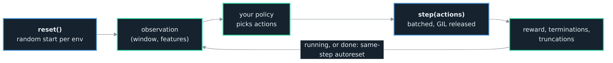

<h1>OCEΛNO <small><code>embeddable-market-simulation-library</code></small></h1>


<div style="padding-top: 0px;">
  <a href="https://www.python.org/downloads/"></a>
  <a href="https://www.rust-lang.org/"></a>
  <a href="https://opensource.org/licenses/MIT"></a>
</div>

<sub>
  <a href="../README.md">Introduction</a> &nbsp;•&nbsp;
  <a href="Python_API.md">Python API</a> &nbsp;•&nbsp;
  <b>RL Guide</b> &nbsp;•&nbsp;
  <a href="Architecture.md">Architecture</a> &nbsp;•&nbsp;
  <a href="Decisions.md">Decisions</a> &nbsp;•&nbsp;
  <a href="Contributor_Guide.md">Contributor Guide</a> &nbsp;•&nbsp;
  <a href="Validation_Guide.md">Validation Guide</a>
</sub>

<br>
<br>
<br>
<br>

## RL Guide

`emsl.rl.VectorEnv` is a Gymnasium-compatible vectorized env over the Rust batch. `num_envs` independent envs share one read-only copy of the data; each starts at a random offset and steps in parallel with the GIL released, so the batch walks decorrelated stretches of history. You control three things: what the agent sees, how it is rewarded, and what its actions do.

<br>

<div align="center">
  
  <p style="margin: 0;"><i>The vectorized loop: observe, act, step every env at once with the GIL released, read the reward; a finished env resets on the same step (ADR 0010).</i></p>
</div>

<br>

```python
import numpy as np
from emsl.rl import VectorEnv

def reward_fn(state, prev):
    return (state.equity - prev.equity) - 0.01 * np.abs(state.position)

env = VectorEnv(
    data=ohlcv,              # (T, 5) fills orders
    features=indicators,     # (T, F) what the agent sees; omit for raw candles
    reward_fn=reward_fn,     # omit for change in equity
    num_envs=4096, window=60, market="perp", slippage_bps=2.0,
)

obs, info = env.reset(seed=0)                      # (4096, 60, F) float32
for _ in range(1000):
    actions = policy(obs)                          # (4096,) Discrete(3)
    obs, rewards, terminations, truncations, infos = env.step(actions)
```

<br>

## Training

You build a cost-accurate, vectorized trading env in one line; training it takes a few more. The env carries the real fill model, fees, funding, and slippage, so an off-the-shelf agent trains against honest costs with no wiring on your part.

The quick path is Stable-Baselines3. `emsl.sb3.EmslVecEnv` presents the batch as an SB3 `VecEnv`, so a stock PPO trains in three lines:

```python
from stable_baselines3 import PPO
from emsl.rl import VectorEnv
from emsl.sb3 import EmslVecEnv

venv = EmslVecEnv(VectorEnv(ohlcv, num_envs=8, window=32, market="perp", seed=0))
PPO("MlpPolicy", venv).learn(total_timesteps=100_000)
```

One adapter serves every SB3 algorithm, so switching is a one-word change:

```python
from stable_baselines3 import A2C, DQN, SAC

model = A2C("MlpPolicy", venv)     # DQN(...) works too on the Discrete(3) action;
                                   # SAC and continuous PPO want a Box action space (see Actions)
```

The standard SB3 vector wrappers compose on top unchanged, to log episodes and normalize the observation and reward:

```python
from stable_baselines3.common.vec_env import VecMonitor, VecNormalize

venv = VecNormalize(VecMonitor(EmslVecEnv(VectorEnv(ohlcv, num_envs=8, window=32, seed=0))))
PPO("MlpPolicy", venv).learn(total_timesteps=100_000)
```

`evaluate_policy` runs a trained model over a fresh env the same way. `emsl.sb3` needs stable-baselines3 (`pip install 'emsl[sb3]'`); because emsl's same-step autoreset already matches SB3's `VecEnv` contract, the adapter is a straight remap, so the GIL-free batch stays intact and an SB3 seed reaches the env.

Save a trained model and reload it later, the usual SB3 way:

```python
model.save("agent")                       # writes agent.zip
model = PPO.load("agent")                 # reload; no env needed to predict
action, _ = model.predict(venv.reset(), deterministic=True)
```

<br>

### Own The Loop

If you would rather write the training loop, the env is a plain Gymnasium vector env, so a single-file policy-gradient or actor-critic loop (the CleanRL shape) reads the batched observation and writes a batched action with no adapter at all. A minimal REINFORCE, PyTorch yours to bring (`pip install torch`):

```python
import torch
import torch.nn as nn

n_actions, hidden, gamma = 3, 128, 0.99
env = VectorEnv(ohlcv, num_envs=512, window=32, market="perp", seed=0)
obs, _ = env.reset(seed=0)

n_in = int(np.prod(env.single_observation_space.shape))    # window * features
policy = nn.Sequential(nn.Flatten(), nn.Linear(n_in, hidden), nn.Tanh(), nn.Linear(hidden, n_actions))
opt = torch.optim.Adam(policy.parameters(), lr=3e-4)

for _ in range(200):
    logps, rewards, masks = [], [], []
    for _ in range(32):                                    # a short rollout
        dist = torch.distributions.Categorical(logits=policy(torch.as_tensor(obs)))
        actions = dist.sample()
        obs, reward, term, trunc, _ = env.step(actions.numpy())
        logps.append(dist.log_prob(actions))
        rewards.append(torch.as_tensor(reward))
        masks.append(torch.as_tensor(~(term | trunc), dtype=torch.float32))

    returns, running = [], torch.zeros(env.num_envs)       # discounted, cut at each episode end
    for reward, mask in zip(reversed(rewards), reversed(masks)):
        running = reward + gamma * running * mask
        returns.insert(0, running)
    returns = torch.stack(returns)
    returns = (returns - returns.mean()) / (returns.std() + 1e-8)

    loss = -(torch.stack(logps) * returns).mean()
    opt.zero_grad()
    loss.backward()
    opt.step()
```

The same-step autoreset puts a finished env's next observation at the start of a fresh episode, so the `~(term | trunc)` mask is what keeps a discounted return from leaking across the boundary.

<br>

## Constructor

Only `data` has no default.

| Argument | Default | Meaning |
| :--- | :--- | :--- |
| `data` | required | `(T, 5)` OHLCV array; fills orders. |
| `features` | `None` | `(T, F)` array the agent observes; `None` observes the raw `(window, 5)` candles. |
| `num_envs` | `8` | Independent envs stepped together. |
| `window` | `32` | Rows per observation; warmup is `window - 1`. |
| `market` | `"spot"` | `"spot"` or `"perp"`. |
| `quote` | `10_000.0` | Starting quote balance per env. |
| `fee_taker`, `fee_maker` | `0.0006`, `0.0002` | Fees, fraction of notional. Scalar, or `(low, high)` sampled per env. |
| `slippage_bps` | `0.0` | Slippage on market fills, basis points. Scalar, or `(low, high)` per env. |
| `impact` | `0.0` | Market-impact coefficient (ADR 0013): extra slippage per unit of the bar's volume filled. Scalar, or `(low, high)` per env. |
| `max_fill_fraction` | `1.0` | Cap on the fraction of a bar's volume one order takes. |
| `max_open_orders` | `8` | Resting-order slots per env. |
| `leverage` | `10.0` | Perp margin cap on notional; the 10x default bounds a fresh perp, `0.0` disables it. |
| `funding_rate` | `0.0` | Perp funding per event on the position notional; a long pays, a short receives. |
| `funding_interval` | `0` | Bars between funding events; `0` disables funding ([ADR 0017](Decisions.md)). |
| `trade_size` | `1.0` | Base size a buy or sell action places. |
| `reward_fn` | `None` | Reward function; `None` uses change in equity. |
| `action_fn` | `None` | Decoder from actions (and state) to per-env sizes; `None` uses the `Discrete(3)` default. |
| `action_space` | `None` | Gymnasium action space; `None` uses `Discrete(3)`. |
| `episode_len` | `None` | Steps before an env truncates and resets; `None` truncates only at the last bar. |
| `seed` | `None` | Seeds the random start offsets and the per-env cost draw. |

<br>

## Observation

The observation is a window of numeric rows, shape `(num_envs, window, F)`, dtype float32. Pass `features` `(T, F)` and the agent sees a window of your indicators, one row per bar; omit it and it sees the raw `(window, 5)` candles, so `F` is 5. The observation space is `Box(shape=(window, F))`, batched across envs.

A window of `window` rows needs that many rows to exist first, so an env's first usable step is at index `window - 1`. Each env starts at a random offset at or after that point, so its window is always full. The series must hold at least `window + 1` rows, a full window plus one bar to step into; a shorter series is a configuration error, so the constructor raises `ValueError` rather than pad the window with zeros.

The observation is a fresh array each step (the batched windows differ once envs sit at different offsets), so it is yours to keep. This differs from the single `Engine.observation`, which is a zero-copy view.

<br>

## Reward

Pass `reward_fn(state, prev)` and it is called once per step, after the step, with the current and previous batched state. Both arguments expose the per-env account fields as `(num_envs,)` arrays: `equity`, `position`, `unrealized_pnl`, `realized_pnl`, `mark_price`. Return one value per env.

```python
def reward_fn(state, prev):
    return (state.equity - prev.equity) - 0.01 * np.abs(state.position)   # equity change, minus a size penalty
```

Because it runs once over arrays rather than once per env, it does not add a Python call per env to the batched step. Omit it and the reward is the change in equity. On the first step after an env resets, its previous equity is that new episode's starting equity, so a delta-equity reward does not spike across the boundary. The engine never computes a reward itself; that is what keeps the core usable outside RL.

<br>

## Actions

By default the action space is `Discrete(3)`: `0` hold, `1` buy `trade_size`, `2` sell `trade_size`, decoded in the env and applied through the batch's GIL-free step. Pass `action_fn(actions, state)` to decode your own: it receives the raw action array and the pre-step batched state (the same snapshot the reward later sees as `prev`) and returns one signed size per env, so like the reward it runs once over arrays, not once per env. Pair it with `action_space` (a Gymnasium space, for example a `Box` for a continuous action) to set what the agent emits.

```python
def action_fn(actions, state):                 # a continuous target position in [-1, 1]
    target = np.clip(actions.reshape(-1), -1.0, 1.0)
    return target - state.position             # trade the difference toward the target
```

<br>

## Cost Randomization

Give a cost knob a `(low, high)` pair instead of a scalar and each env draws its own value uniformly from that range, so the batch trains across a spread of cost regimes rather than one exact setting. It applies to `fee_taker`, `fee_maker`, `slippage_bps`, and `impact`.

```python
env = VectorEnv(
    data=ohlcv, num_envs=4096, window=60, market="perp",
    fee_taker=(0.0002, 0.0008),        # each env a different taker fee
    slippage_bps=(0.0, 4.0),           # and a different slippage
    seed=0,                            # reproduces the draw
)
```

The draw uses the constructor `seed` and is fixed for each env's life: an env keeps its costs across autoresets rather than resampling, so it is fixed heterogeneity across workers, not per-episode noise. A policy that holds up across the spread is less likely to be fit to one lucky cost setting. The reasoning, and why sampling lives in Python rather than Rust, is in [ADR 0014](Decisions.md). For a distribution other than uniform, sample the per-env costs yourself and pass the arrays to [`emsl.Batch`](Python_API.md#batch) directly.

The per-env cost draw and the start offsets come from independent generators, both spawned from the constructor `seed`, so a given `seed` produces the same start offsets whether or not a cost range is passed. The cost draw is fixed for the env's life; `reset(seed=...)` re-seeds only the offset stream.

<br>

## Episodes and Autoreset

An env ends in one of two ways, reported as separate `(num_envs,)` boolean arrays:

- **`terminations[i]`** is true when env `i`'s equity fell to zero or below, a true terminal. On perp that is a liquidation, force-closed at the bar's adverse extreme; on either market an account otherwise drained to zero at the close terminates too ([ADR 0019](Decisions.md)).
- **`truncations[i]`** is true when env `i` reached the last bar, or `episode_len` steps if that is set, a time limit.

Finished envs auto-reset on the same step: the observation returned for a done env is already the first observation of its next episode, at a fresh random offset. The true final observation and equity of the episode that ended are placed in `infos`:

| infos key | |
| :--- | :--- |
| `final_observation` | object array; the final observation at done indices, `None` elsewhere. |
| `_final_observation` | boolean mask of which entries are set. |
| `final_equity` | float array; the final equity at done indices, `NaN` elsewhere. |
| `_final_equity` | boolean mask. |

This is the pre-1.0 Gymnasium vector autoreset, the same-step convention the large body of single-file RL code was written against. The env implements it itself, so it holds even on Gymnasium 1.x, whose newer next-step autoreset is deliberately not used; the choice is recorded in [ADR 0010](Decisions.md). On Gymnasium versions that tag autoreset style, the env declares `SAME_STEP` in its metadata, so a vector wrapper handles it correctly instead of assuming the next-step default.

<br>

## Gymnasium Surface

`VectorEnv` subclasses `gymnasium.vector.VectorEnv` and exposes `num_envs`, `single_observation_space` (`Box(window, F)`), `single_action_space` (`Discrete(3)`), and their batched forms. `reset(seed=None, options=None)` returns `(obs, info)`; `step(actions)` returns `(obs, rewards, terminations, truncations, infos)`.

<br>

## On the Cost Hook

The spec sketched a per-fill `cost_fn(fill, state)` callback. It is deliberately not offered: a Python callback cannot run inside the GIL-free batched step without dragging the engine back under the GIL and down to Python speed. Its size-dependent intent lives instead in the `impact` coefficient (a worse fill for a larger share of the bar's volume), and its cross-env variety in the cost ranges above. The reasoning is in [ADR 0013](Decisions.md).
