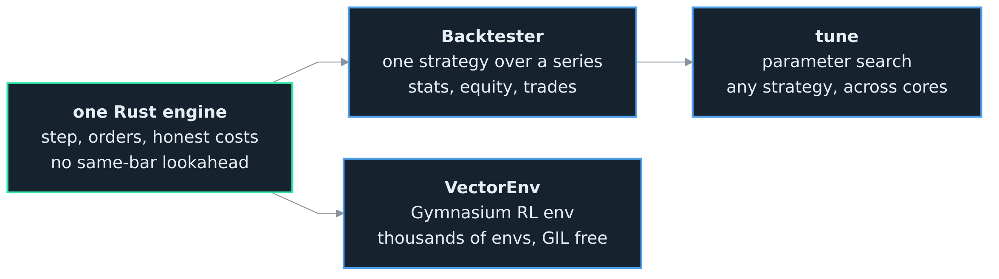

<h1>OCEΛNO <small><code>embeddable-market-simulation-library</code></small></h1>


<div style="padding-top: 0px;">
  <a href="https://www.python.org/downloads/"></a>
  <a href="https://www.rust-lang.org/"></a>
  <a href="https://opensource.org/licenses/MIT"></a>
</div>

<sub>
  <b>Introduction</b> &nbsp;•&nbsp;
  <a href=".Documentation/Python_API.md">Python API</a> &nbsp;•&nbsp;
  <a href=".Documentation/RL_Guide.md">RL Guide</a> &nbsp;•&nbsp;
  <a href=".Documentation/Architecture.md">Architecture</a> &nbsp;•&nbsp;
  <a href=".Documentation/Decisions.md">Decisions</a> &nbsp;•&nbsp;
  <a href=".Documentation/Contributor_Guide.md">Contributor Guide</a> &nbsp;•&nbsp;
  <a href=".Documentation/Validation_Guide.md">Validation Guide</a>
</sub>

<br>
<br>
<br>
<br>

## Introduction

`emsl` is **a bar-level crypto market simulator: a Rust core with a small Python surface.** Give it a table of candles and it stands in for the exchange: you step forward one bar at a time, place the order types a real venue offers, and read back your balance, position, and equity, with the real fees, funding, and slippage charged as you go.

The point is research speed. A single backtest, a parameter search over thousands of configurations, and a batched reinforcement-learning rollout all run on the same engine through one API, so the simulator is never the part you rebuild between experiments. You write a strategy or an agent once, against one fill model and one set of costs, and move between those jobs without reconciling separate simulators or second-guessing which costs each of them charged. The honest market stays a fixed point; only the question you are asking changes.

The whole engine is one small loop: load candles, place an order if you want to, call `step` to advance exactly one candle, read your new state, repeat until the data runs out. Everything else, the RL env and the backtester, is a thin wrapper that drives that same loop for you.

**Embeddable, not a framework.** You own the loop, so it drops into a system you already have instead of forcing you into its own. The core knows nothing about rewards, indicators, or charts; it advances a candle and returns a state. That is what lets one engine serve both a five-line backtest and a batched RL rollout, and it is why each word of the name is a fact rather than a brand.

<br>

<div align="center">
  
  <p style="margin: 0;"><i>One engine and one fill model behind a backtest, a Gymnasium RL env, and a parameter search.</i></p>
</div>

<br>
<br>

## Scope and Fidelity

It **does**: event-driven bar simulation, thousands of parallel runs over one shared series, the order types a real venue offers, a cost model (maker/taker fees, perp funding, slippage, market impact, a per-order volume cap), and a small Python API.

It **does not**: model the full order book (L2), latency, or queue position, and it places no live orders. This is the bar-level, approximate member of a planned family; a future sibling is a tick and L2 engine at higher resolution. At bar granularity the fill model cannot see the intrabar path, so it can be slightly more generous than a live book would be; the costs it charges are the real ones. The bar-level resolution limits are recorded in [ADR 0006](.Documentation/Decisions.md).

**Who it is for.** Quant and machine-learning researchers. Not market makers or high-frequency desks, who run C++ and FPGA next to the exchange and need the order book this tier does not model. One decision per candle is the resolution most research works at.

**How it differs from what you already use.** If you have driven a vectorized backtester, you know it cannot express a stop or a flip whose fill depends on the path the price took; emsl can, and runs thousands of such paths in parallel. If you have driven a general backtesting framework, you know it owns your loop; here you own it. If you have used an off-the-shelf RL trading env, you know the fills are a toy; here the backtest, the RL env, and the sweep share one fill model and the same costs.

<br>
<br>

## How It Works

You hand the engine a table of candles and walk it forward one bar at a time. On any bar you can place an order, a market buy or sell, a limit, or a stop, then call `step` to advance exactly one candle: it resolves whatever is pending and hands back your new account, the balances, position, and equity. Repeat to the end of the data. That loop is the whole engine; the backtester and the RL env are wrappers around it.

The rule that keeps you honest is one bar of delay: you decide on the close of a bar and the order fills on the **next** one, never the bar the decision saw. That guard against same-bar lookahead is what separates a believable backtest from a fooled one.

Point it at real candles with the sibling [`exchange-router-service`](https://github.com/atOCEANO/exchange-router-service), which hands back a ready-to-use DataFrame:

```python
from exchange_router_client import ExchangeRouterClient

with ExchangeRouterClient("http://localhost:8040") as client:
    candles = client.get_candles("binance", "spot", "BTCUSDT", interval="1h", limit=5000)
```

Then step through it. `emsl.to_ohlcv` turns that DataFrame (or a parquet path, or a numpy array you already hold) into the `(T, 5)` array the engine takes, ignoring the router's extra `volume_usd` column and handling its datetime index for you. Here a plain momentum rule: long above the last day's average, flat below it.

```python
from emsl import Engine, to_ohlcv

eng = Engine(to_ohlcv(candles), market="spot", quote=10_000)
close = eng.data[:, 3]                         # zero-copy view of every close
state = eng.reset()
while not eng.done():
    i = state["tick_index"]
    if i >= 24:                                # a day of hourly history
        avg = close[i - 24:i].mean()
        if state["position"] == 0 and close[i] > avg:
            eng.market_buy(0.1)                # decided now, fills on the next bar
        elif state["position"] > 0 and close[i] < avg:
            eng.close()                        # flatten below it
    state = eng.step()

print(state["equity"], state["position"])      # account value and position at the end
```

<br>
<br>

## Ways to Drive It

### Raw engine

The order verbs mirror a real exchange, so a strategy is written against the same calls it would use live. `market_buy` / `market_sell` (taker, fills at the next open), `limit_buy` / `limit_sell` (maker, rests until a candle reaches it), `stop(side, size, trigger)`, `close()`, `cancel(order_id)`, and `cancel_all()`. The full `order(side, size, type=, price=, trigger=, reduce_only=, post_only=, tif=)` primitive sets the flags the shortcuts leave default (a reduce-only stop-loss, a post-only limit, an IOC or FOK fill), and `qty_from_weight` / `qty_from_quote` size an order from a fraction of equity or a cash amount. One netted position: net long, net short, or flat, never both, and never short on spot. Every `step` returns a state dict; see the [Python API](.Documentation/Python_API.md) for the full field list and order semantics.

### Backtest

A classic `Strategy` class with `init` and `next`, driven over the series, returning stats, the equity curve, and the trade log.

```python
from emsl.backtest import Backtester, Strategy

class BuyDip(Strategy):
    def init(self, engine):
        self.close = engine.data[:, 3]        # zero-copy view of the closes

    def next(self, state, engine):
        i = state["tick_index"]
        if i > 0 and state["position"] == 0 and self.close[i] < self.close[i - 1]:
            engine.market_buy(1.0)            # buy after a down bar
        elif state["position"] > 0 and self.close[i] > self.close[i - 1]:
            engine.close()                    # close into the next up bar

result = Backtester(ohlcv, market="spot").run(BuyDip())
print(result.stats["sharpe"], result.stats["max_drawdown_pct"])
print(len(result.trades), "trades")
```

The full stats set (total return, net profit, CAGR, Sharpe, Sortino, Calmar, drawdown, volatility, exposure, win rate, profit factor, average trade, and the trade log) is in the [Python API](.Documentation/Python_API.md#backtesting).

### Reinforcement learning

A Gymnasium-compatible vectorized env. You control the observation (a window of your own features), the reward (a function over the batched state), and the action decoding. Thousands of envs step in parallel, each starting at a random offset so they walk decorrelated stretches of history, sharing one read-only copy of the data.

```python
import numpy as np
from emsl.rl import VectorEnv

def reward_fn(state, prev):                       # batched, one value per env
    return (state.equity - prev.equity) - 0.01 * np.abs(state.position)

env = VectorEnv(
    data=ohlcv,                                    # (T, 5) fills orders
    features=my_indicators,                        # (T, F) what the agent sees
    reward_fn=reward_fn,
    num_envs=4096, window=60, market="perp", slippage_bps=2.0,
)
obs, info = env.reset(seed=0)                      # (4096, 60, F) float32
for _ in range(1000):
    actions = policy(obs)                          # (4096,) Discrete(3)
    obs, rewards, terminations, truncations, infos = env.step(actions)
    # 4096 envs stepped in parallel, GIL released; finished ones auto-reset,
    # their final obs and equity in infos
```

Or skip the loop and hand it to Stable-Baselines3, which trains on the same env in three lines:

```python
from stable_baselines3 import PPO
from emsl.sb3 import EmslVecEnv

PPO("MlpPolicy", EmslVecEnv(env)).learn(total_timesteps=100_000)   # A2C, DQN, SAC swap in
```

The observation, reward, action, and autoreset contract, and the full training examples, are in the [RL Guide](.Documentation/RL_Guide.md).

### Parameter search

Search a strategy's parameters for the setting that maximizes an objective. `tune` runs each trial as a full backtest through the same `Backtester`, so the strategy you backtest is the strategy you tune, and the trials run across worker processes, so the search scales over cores. This is the path for a strategy you write.

```python
from emsl import tune
from emsl.backtest import Strategy

class SmaCross(Strategy):
    def __init__(self, fast, slow):           # the tunables, as constructor arguments
        self.fast, self.slow = fast, slow

    def init(self, engine):
        self.close = engine.data[:, 3]

    def next(self, state, engine):
        i = state["tick_index"]
        if i < self.slow:
            return
        fast = self.close[i - self.fast:i].mean()
        slow = self.close[i - self.slow:i].mean()
        if state["position"] == 0 and fast > slow:
            engine.market_buy(1.0)            # long when the fast average leads
        elif state["position"] > 0 and fast < slow:
            engine.close()                    # flat when it falls back

result = tune(
    SmaCross,                                 # your strategy, or any callable that builds one
    {"fast": (5, 40), "slow": (40, 200)},     # the space to search
    ohlcv,
    objective="sharpe", n_trials=200, n_jobs=-1,   # -1 uses every core
)
print(result.best_params, result.best_value)
```

`objective` takes any stats key, or a function of your own over the finished run, so you can score on something the stats set does not name. It receives the whole `BacktestResult`, which puts the equity curve and every trade in reach, and a lambda or a closure survives the trip to the worker processes:

```python
def risk_adjusted(result):
    stats = result.stats
    if stats["num_trades"] < 20:                       # ignore configs that barely trade
        return -1e9
    return stats["sharpe"] - 0.1 * stats["max_drawdown_pct"]

result = tune(SmaCross, {"fast": (5, 40), "slow": (40, 200)}, ohlcv,
              objective=risk_adjusted, n_trials=200, n_jobs=-1)
```

Higher wins by default; pass `direction="minimize"` when your metric is a cost. A trial whose objective returns `NaN` is failed and the search moves on.

`tune` needs optuna and cloudpickle (`pip install 'emsl[tune]'`); the [Python API](.Documentation/Python_API.md#tuning) covers the search space, objective, and result in full.

<br>
<br>

## Speed

Throughput depends on which path you drive, and they differ by orders of magnitude, so it is worth knowing which one you are on. Measured on a 28-thread x86_64 box against the built wheel over a 2,000-bar series:

| Path | Throughput | What bounds it |
| :--- | ---: | :--- |
| Single-env raw step | ~358K steps/s | the Python-to-Rust boundary, crossed on every `step` |
| Single-env with a Python strategy | ~77K steps/s | your per-bar Python, not the engine |
| Batched RL step | ~110-200K env-steps/s | building the observation, GIL released |

The single-env rows say something worth internalizing: the engine steps at about 358K per second with nothing attached, and a strategy that recomputes indicators with numpy on every bar drops that to about 77K, so a single backtest is bound by your own per-bar code, not by emsl. Vectorize the indicators once and the rate climbs back toward the engine. The batched RL step releases the GIL and moves every env together, bound by building the observation rather than by the fill. A parameter search scales the other way, across processes rather than per bar, so its rate is trials per second and it grows with the cores you give it.

These move with hardware and workload, so treat them as shape, not a promise. Run `benchmarks/throughput.py` for your own machine, and the Criterion bench in `crates/bar-engine/benches` for the pure-Rust step and the in-core sweep.

<br>
<br>

## Install

Every [release](https://github.com/atOCEANO/embeddable-market-simulation-library/releases) carries prebuilt wheels for Linux (x86_64 and aarch64), macOS (Intel and Apple silicon in one universal2 file), and Windows. Installing from those needs no compiler, and pip picks the one matching your machine:

```bash
pip install --find-links https://github.com/atOCEANO/embeddable-market-simulation-library/releases/expanded_assets/v0.1.0 emsl
```

The optional extras work the same way and stack:

| Extra | Pulls | For |
| :--- | :--- | :--- |
| `data` | pandas, pyarrow | DataFrame and parquet input |
| `tune` | optuna, cloudpickle | the `emsl.tune` parameter search |
| `sb3` | stable-baselines3 | the Stable-Baselines3 adapter |

```bash
pip install --find-links https://github.com/atOCEANO/embeddable-market-simulation-library/releases/expanded_assets/v0.1.0 "emsl[tune,sb3]"
```

To choose the wheel yourself, take its URL from the release assets:

```bash
pip install https://github.com/atOCEANO/embeddable-market-simulation-library/releases/download/v0.1.0/emsl-0.1.0-cp39-abi3-manylinux_2_17_x86_64.manylinux2014_x86_64.whl
```

Building from source instead needs the Rust toolchain ([rustup](https://rustup.rs)), and pip drives the build for you. Pin the tag when a build has to be reproducible:

```bash
pip install "git+https://github.com/atOCEANO/embeddable-market-simulation-library.git@v0.1.0"
```

From a local checkout, either as a plain install or as a development build:

```bash
git clone https://github.com/atOCEANO/embeddable-market-simulation-library.git
cd embeddable-market-simulation-library

pip install .                    # a normal install from the checkout
                                 # or, to work on the library itself:
pip install maturin
maturin develop --release        # compiles the abi3 extension into the active venv
```

Or build the wheel once and install that copy wherever you need it:

```bash
maturin build --release --out dist
pip install dist/*.whl
```

That one stable-ABI wheel covers Python 3.9 and up, so the same file serves every interpreter in that range, and `numpy` and `gymnasium` install with the package. emsl is not published on PyPI, so a bare `pip install emsl` finds nothing; use one of the forms above.

<br>
<br>

## Building and Validating

The pure-Rust crates validate locally with cargo; the Python surface validates on a Docker gate that builds the one abi3 wheel and runs the test suite across Python 3.9, 3.11, and 3.12. The riskiest code is adversarially verified, a process that has caught real bugs before they shipped; the full workflow is in the [Validation Guide](.Documentation/Validation_Guide.md).

```bash
cargo test -p emsl-core -p bar-engine     # pure-Rust core
cargo clippy --workspace --all-targets -- -D warnings
docker build --target test311 .           # wheel + pytest on Python 3.11
```
